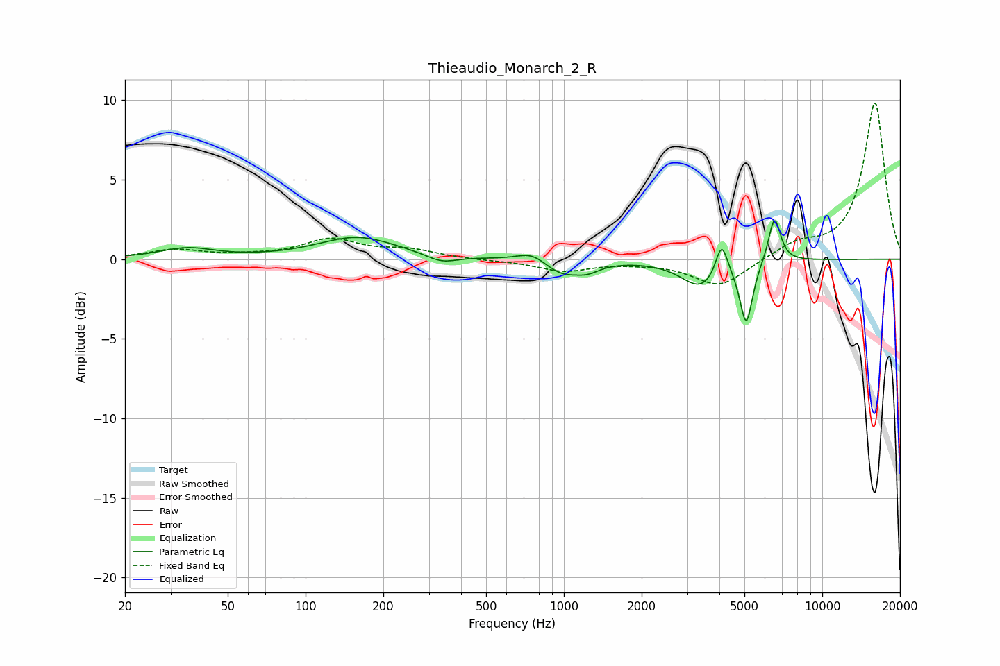

# Thieaudio_Monarch_2_R
See [usage instructions](https://github.com/jaakkopasanen/AutoEq#usage) for more options and info.

### Parametric EQs
Apply preamp of -2.5 dB when using parametric equalizer.

|   # | Type    |   Fc (Hz) |    Q |   Gain (dB) |
|-----|---------|-----------|------|-------------|
|   1 | Peaking |        35 | 1.36 |         0.6 |
|   2 | Peaking |       159 | 0.93 |         1.4 |
|   3 | Peaking |       336 | 2.41 |        -0.5 |
|   4 | Peaking |       754 | 2.47 |         0.7 |
|   5 | Peaking |       980 | 1.92 |        -1   |
|   6 | Peaking |      1238 | 3.01 |        -0.5 |
|   7 | Peaking |      3404 | 1.87 |        -1.7 |
|   8 | Peaking |      4081 | 6    |         2.2 |
|   9 | Peaking |      5081 | 5.78 |        -3.9 |
|  10 | Peaking |      6536 | 5.92 |         2.9 |

### Fixed Band EQs
When using fixed band (also called graphic) equalizer, apply preamp of **-9.9 dB** (if available) and set gains manually with these parameters.

|   # | Type    |   Fc (Hz) |    Q |   Gain (dB) |
|-----|---------|-----------|------|-------------|
|   1 | Peaking |        31 | 1.41 |         0.6 |
|   2 | Peaking |        62 | 1.41 |         0.1 |
|   3 | Peaking |       125 | 1.41 |         1.2 |
|   4 | Peaking |       250 | 1.41 |         0.5 |
|   5 | Peaking |       500 | 1.41 |        -0.1 |
|   6 | Peaking |      1000 | 1.41 |        -0.7 |
|   7 | Peaking |      2000 | 1.41 |        -0.1 |
|   8 | Peaking |      4000 | 1.41 |        -1.7 |
|   9 | Peaking |      8000 | 1.41 |         0.9 |
|  10 | Peaking |     16000 | 1.41 |         9.9 |

### Graphs

