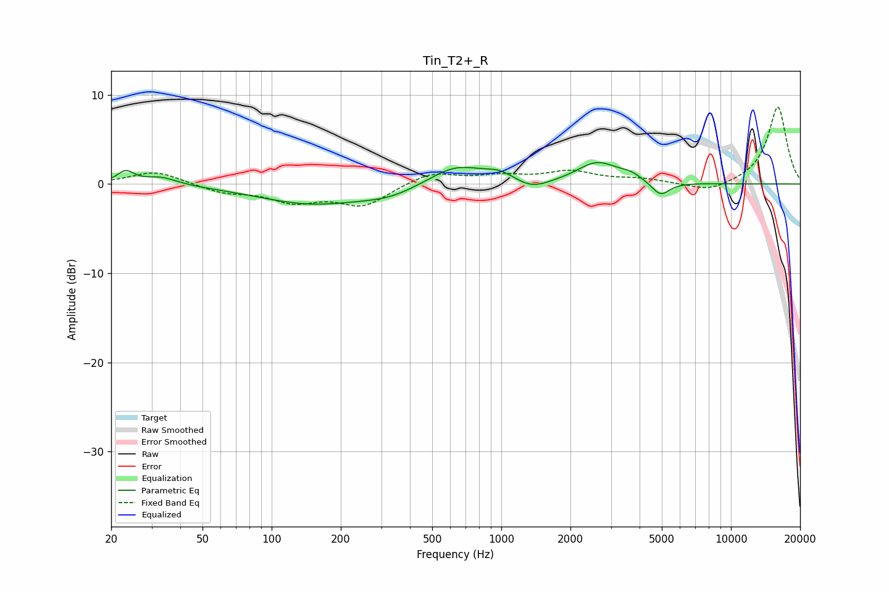

# Tin_T2+_R
See [usage instructions](https://github.com/jaakkopasanen/AutoEq#usage) for more options and info.

### Parametric EQs
Apply preamp of -2.5 dB when using parametric equalizer.

|   # | Type    |   Fc (Hz) |    Q |   Gain (dB) |
|-----|---------|-----------|------|-------------|
|   1 | Peaking |        23 | 3.94 |         1.4 |
|   2 | Peaking |        33 | 1.98 |         0.9 |
|   3 | Peaking |       148 | 0.6  |        -2.1 |
|   4 | Peaking |       325 | 1.08 |        -1   |
|   5 | Peaking |       634 | 1.18 |         2.2 |
|   6 | Peaking |       986 | 2.2  |         1   |
|   7 | Peaking |      1358 | 1.93 |        -1   |
|   8 | Peaking |      2613 | 1.62 |         2.3 |
|   9 | Peaking |      3650 | 2.67 |         0.7 |
|  10 | Peaking |      4931 | 3.49 |        -1.6 |

### Fixed Band EQs
When using fixed band (also called graphic) equalizer, apply preamp of **-8.7 dB** (if available) and set gains manually with these parameters.

|   # | Type    |   Fc (Hz) |    Q |   Gain (dB) |
|-----|---------|-----------|------|-------------|
|   1 | Peaking |        31 | 1.41 |         1.5 |
|   2 | Peaking |        62 | 1.41 |        -0.9 |
|   3 | Peaking |       125 | 1.41 |        -1.8 |
|   4 | Peaking |       250 | 1.41 |        -2.4 |
|   5 | Peaking |       500 | 1.41 |         1.4 |
|   6 | Peaking |      1000 | 1.41 |         0.8 |
|   7 | Peaking |      2000 | 1.41 |         1.3 |
|   8 | Peaking |      4000 | 1.41 |         0.5 |
|   9 | Peaking |      8000 | 1.41 |        -1   |
|  10 | Peaking |     16000 | 1.41 |         8.7 |

### Graphs

