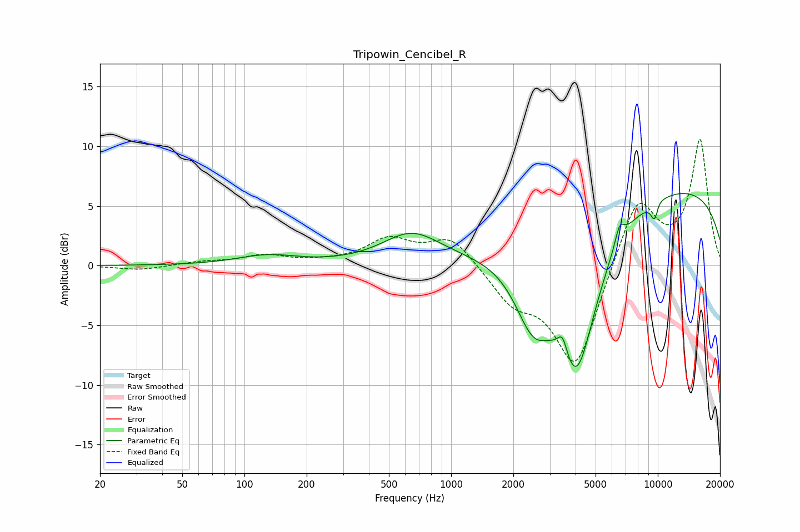

# Tripowin_Cencibel_R
See [usage instructions](https://github.com/jaakkopasanen/AutoEq#usage) for more options and info.

### Parametric EQs
Apply preamp of -6.1 dB when using parametric equalizer.

|   # | Type    |   Fc (Hz) |    Q |   Gain (dB) |
|-----|---------|-----------|------|-------------|
|   1 | Peaking |       129 | 0.97 |         0.8 |
|   2 | Peaking |       643 | 1    |         2.6 |
|   3 | Peaking |      2487 | 1.57 |        -5.3 |
|   4 | Peaking |      3461 | 6    |         1.7 |
|   5 | Peaking |      4047 | 1.31 |       -12.8 |
|   6 | Peaking |      6533 | 5.94 |         1.6 |
|   7 | Peaking |      9658 | 5.43 |         2.2 |
|   8 | Peaking |      9663 | 5.92 |        -3.9 |
|   9 | Peaking |     10000 | 0.2  |         6.8 |
|  10 | Peaking |     10000 | 5.8  |         0.5 |

### Fixed Band EQs
When using fixed band (also called graphic) equalizer, apply preamp of **-10.7 dB** (if available) and set gains manually with these parameters.

|   # | Type    |   Fc (Hz) |    Q |   Gain (dB) |
|-----|---------|-----------|------|-------------|
|   1 | Peaking |        31 | 1.41 |        -0.4 |
|   2 | Peaking |        62 | 1.41 |         0.3 |
|   3 | Peaking |       125 | 1.41 |         0.8 |
|   4 | Peaking |       250 | 1.41 |         0.2 |
|   5 | Peaking |       500 | 1.41 |         2.1 |
|   6 | Peaking |      1000 | 1.41 |         2.4 |
|   7 | Peaking |      2000 | 1.41 |        -2.7 |
|   8 | Peaking |      4000 | 1.41 |        -8.6 |
|   9 | Peaking |      8000 | 1.41 |         5.9 |
|  10 | Peaking |     16000 | 1.41 |        10.4 |

### Graphs

