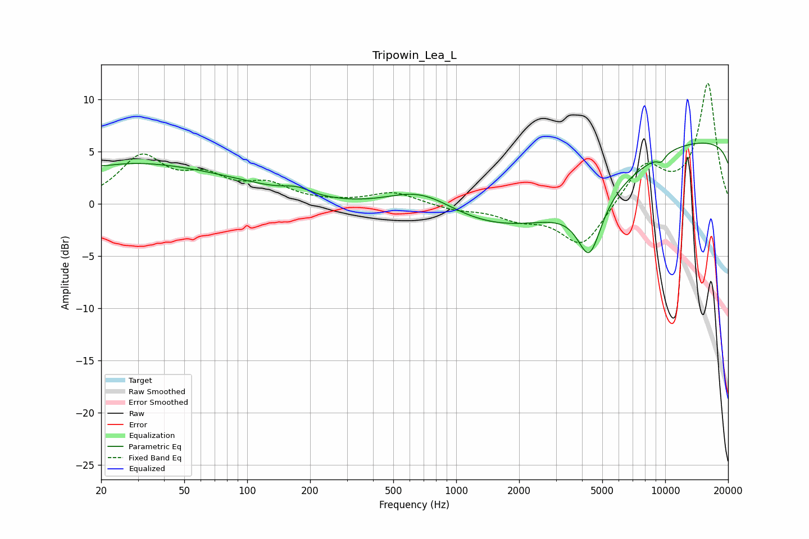

# Tripowin_Lea_L
See [usage instructions](https://github.com/jaakkopasanen/AutoEq#usage) for more options and info.

### Parametric EQs
Apply preamp of -5.9 dB when using parametric equalizer.

|   # | Type    |   Fc (Hz) |    Q |   Gain (dB) |
|-----|---------|-----------|------|-------------|
|   1 | Peaking |        20 | 1.64 |        -0.3 |
|   2 | Peaking |        21 | 0.3  |         3.8 |
|   3 | Peaking |        88 | 0.5  |         0.8 |
|   4 | Peaking |       174 | 2.22 |         0.6 |
|   5 | Peaking |       681 | 0.79 |         3.2 |
|   6 | Peaking |      1411 | 0.33 |        -4.6 |
|   7 | Peaking |      4341 | 2.46 |        -5.5 |
|   8 | Peaking |      6924 | 0.22 |       -15.2 |
|   9 | Peaking |      8480 | 0.18 |        20   |
|  10 | Peaking |      9581 | 6    |        -0.7 |

### Fixed Band EQs
When using fixed band (also called graphic) equalizer, apply preamp of **-11.6 dB** (if available) and set gains manually with these parameters.

|   # | Type    |   Fc (Hz) |    Q |   Gain (dB) |
|-----|---------|-----------|------|-------------|
|   1 | Peaking |        31 | 1.41 |         4.3 |
|   2 | Peaking |        62 | 1.41 |         2.2 |
|   3 | Peaking |       125 | 1.41 |         1.6 |
|   4 | Peaking |       250 | 1.41 |         0.1 |
|   5 | Peaking |       500 | 1.41 |         1.1 |
|   6 | Peaking |      1000 | 1.41 |        -0.5 |
|   7 | Peaking |      2000 | 1.41 |        -1.2 |
|   8 | Peaking |      4000 | 1.41 |        -4.1 |
|   9 | Peaking |      8000 | 1.41 |         3.7 |
|  10 | Peaking |     16000 | 1.41 |        11.5 |

### Graphs

