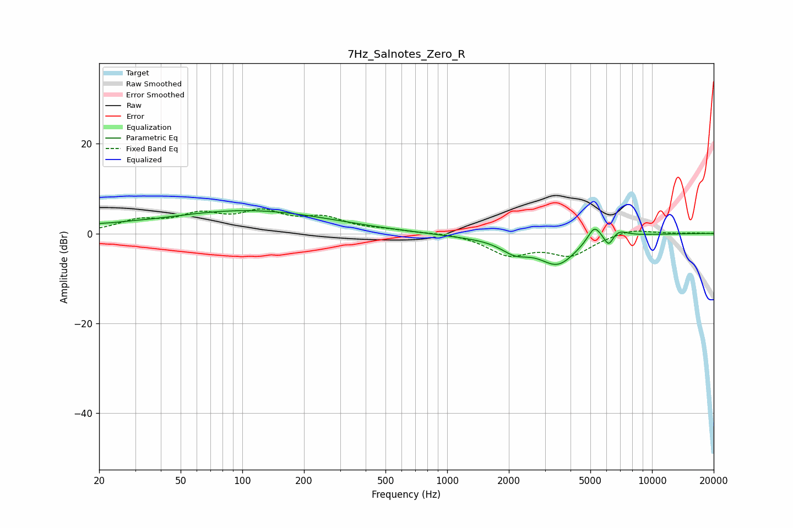

# 7Hz_Salnotes_Zero_R
See [usage instructions](https://github.com/jaakkopasanen/AutoEq#usage) for more options and info.

### Parametric EQs
Apply preamp of -5.2 dB when using parametric equalizer.

|   # | Type    |   Fc (Hz) |    Q |   Gain (dB) |
|-----|---------|-----------|------|-------------|
|   1 | Peaking |        20 | 5.85 |         0.3 |
|   2 | Peaking |        24 | 1.08 |         0.7 |
|   3 | Peaking |        95 | 0.35 |         4.4 |
|   4 | Peaking |       179 | 0.41 |         0.8 |
|   5 | Peaking |      1247 | 0.84 |        -0.5 |
|   6 | Peaking |      2143 | 1.96 |        -2.9 |
|   7 | Peaking |      3467 | 1.49 |        -6.4 |
|   8 | Peaking |      5225 | 4.22 |         3.6 |
|   9 | Peaking |      6153 | 6    |        -2.8 |
|  10 | Peaking |      6820 | 3.19 |         1.6 |

### Fixed Band EQs
When using fixed band (also called graphic) equalizer, apply preamp of **-5.6 dB** (if available) and set gains manually with these parameters.

|   # | Type    |   Fc (Hz) |    Q |   Gain (dB) |
|-----|---------|-----------|------|-------------|
|   1 | Peaking |        31 | 1.41 |         2.6 |
|   2 | Peaking |        62 | 1.41 |         3.6 |
|   3 | Peaking |       125 | 1.41 |         4.1 |
|   4 | Peaking |       250 | 1.41 |         3   |
|   5 | Peaking |       500 | 1.41 |         0.6 |
|   6 | Peaking |      1000 | 1.41 |         0.3 |
|   7 | Peaking |      2000 | 1.41 |        -4.4 |
|   8 | Peaking |      4000 | 1.41 |        -4.5 |
|   9 | Peaking |      8000 | 1.41 |         1.2 |
|  10 | Peaking |     16000 | 1.41 |         0.1 |

### Graphs

