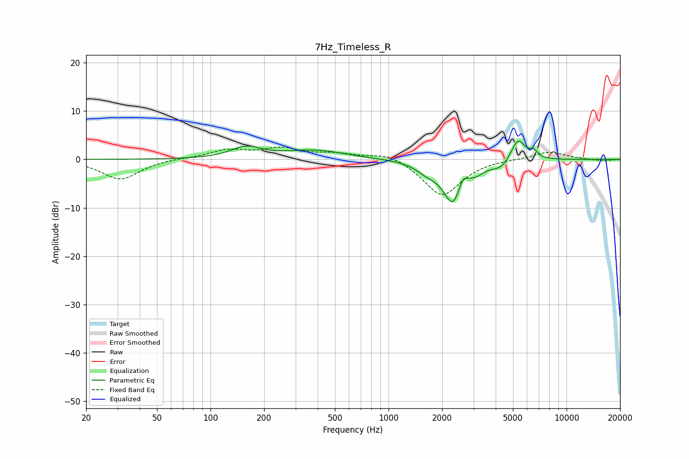

# 7Hz_Timeless_R
See [usage instructions](https://github.com/jaakkopasanen/AutoEq#usage) for more options and info.

### Parametric EQs
Apply preamp of -3.9 dB when using parametric equalizer.

|   # | Type    |   Fc (Hz) |    Q |   Gain (dB) |
|-----|---------|-----------|------|-------------|
|   1 | Peaking |       158 | 1.66 |         2.3 |
|   2 | Peaking |       387 | 0.84 |         1.8 |
|   3 | Peaking |      1646 | 2.25 |        -1.7 |
|   4 | Peaking |      2297 | 2.57 |        -8.7 |
|   5 | Peaking |      2607 | 6    |         2.2 |
|   6 | Peaking |      3123 | 3.78 |        -1.1 |
|   7 | Peaking |      4350 | 2.25 |        -2.1 |
|   8 | Peaking |      5271 | 3.13 |         4.3 |
|   9 | Peaking |      5467 | 4.82 |         0.9 |
|  10 | Peaking |      6544 | 6    |         1.4 |

### Fixed Band EQs
When using fixed band (also called graphic) equalizer, apply preamp of **-2.7 dB** (if available) and set gains manually with these parameters.

|   # | Type    |   Fc (Hz) |    Q |   Gain (dB) |
|-----|---------|-----------|------|-------------|
|   1 | Peaking |        31 | 1.41 |        -4.1 |
|   2 | Peaking |        62 | 1.41 |         0.2 |
|   3 | Peaking |       125 | 1.41 |         1.8 |
|   4 | Peaking |       250 | 1.41 |         2.1 |
|   5 | Peaking |       500 | 1.41 |         1   |
|   6 | Peaking |      1000 | 1.41 |         1.5 |
|   7 | Peaking |      2000 | 1.41 |        -7.7 |
|   8 | Peaking |      4000 | 1.41 |         0.2 |
|   9 | Peaking |      8000 | 1.41 |         1.7 |
|  10 | Peaking |     16000 | 1.41 |        -0.3 |

### Graphs

