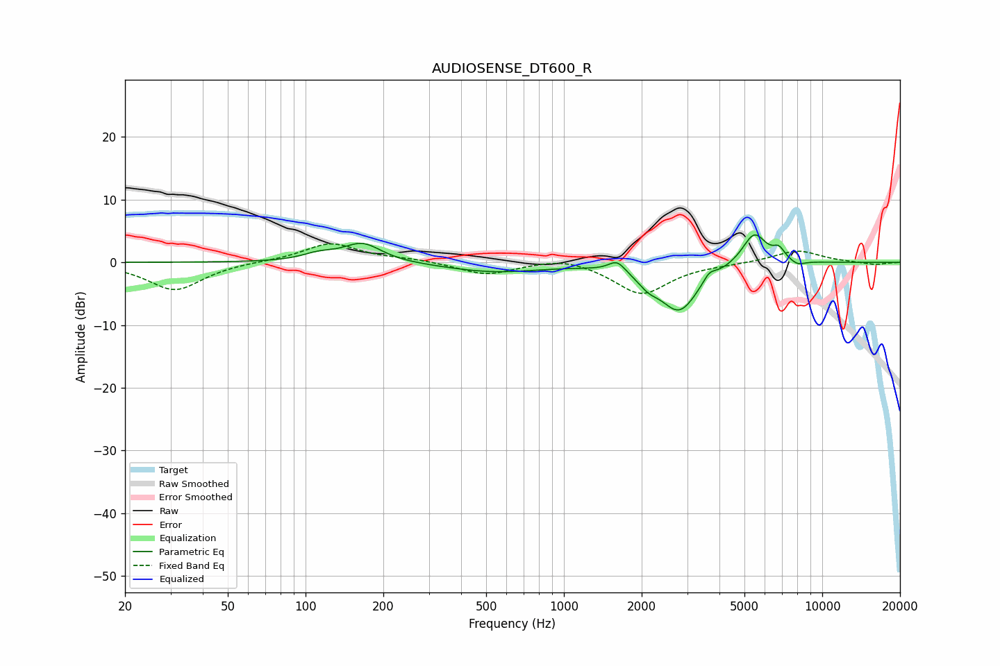

# AUDIOSENSE_DT600_R
See [usage instructions](https://github.com/jaakkopasanen/AutoEq#usage) for more options and info.

### Parametric EQs
Apply preamp of -4.5 dB when using parametric equalizer.

|   # | Type    |   Fc (Hz) |    Q |   Gain (dB) |
|-----|---------|-----------|------|-------------|
|   1 | Peaking |       112 | 2.2  |         1   |
|   2 | Peaking |       166 | 1.91 |         3   |
|   3 | Peaking |       535 | 0.76 |        -1.5 |
|   4 | Peaking |      1606 | 4.4  |         1.8 |
|   5 | Peaking |      2121 | 3.65 |        -1.5 |
|   6 | Peaking |      2795 | 1.83 |        -7.6 |
|   7 | Peaking |      3655 | 5.82 |         1.4 |
|   8 | Peaking |      5458 | 2.94 |         5.2 |
|   9 | Peaking |      6803 | 6    |         1.7 |
|  10 | Peaking |      8036 | 4.74 |        -0.7 |

### Fixed Band EQs
When using fixed band (also called graphic) equalizer, apply preamp of **-3.0 dB** (if available) and set gains manually with these parameters.

|   # | Type    |   Fc (Hz) |    Q |   Gain (dB) |
|-----|---------|-----------|------|-------------|
|   1 | Peaking |        31 | 1.41 |        -4.5 |
|   2 | Peaking |        62 | 1.41 |         0.1 |
|   3 | Peaking |       125 | 1.41 |         3.1 |
|   4 | Peaking |       250 | 1.41 |         0.5 |
|   5 | Peaking |       500 | 1.41 |        -2   |
|   6 | Peaking |      1000 | 1.41 |         1   |
|   7 | Peaking |      2000 | 1.41 |        -5.1 |
|   8 | Peaking |      4000 | 1.41 |        -0.2 |
|   9 | Peaking |      8000 | 1.41 |         2   |
|  10 | Peaking |     16000 | 1.41 |        -0.4 |

### Graphs

