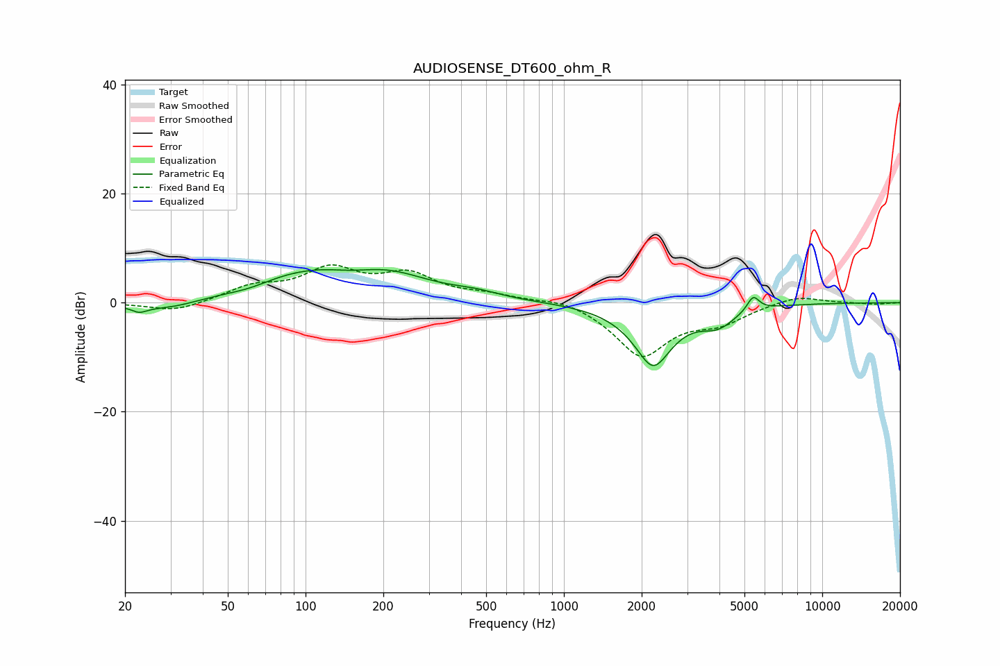

# AUDIOSENSE_DT600_ohm_R
See [usage instructions](https://github.com/jaakkopasanen/AutoEq#usage) for more options and info.

### Parametric EQs
Apply preamp of -6.2 dB when using parametric equalizer.

|   # | Type    |   Fc (Hz) |    Q |   Gain (dB) |
|-----|---------|-----------|------|-------------|
|   1 | Peaking |        23 | 5.3  |        -0.9 |
|   2 | Peaking |        29 | 0.9  |        -2.2 |
|   3 | Peaking |        60 | 1.49 |        -1.1 |
|   4 | Peaking |       107 | 0.49 |         6   |
|   5 | Peaking |       150 | 1.81 |        -0.7 |
|   6 | Peaking |       218 | 0.99 |         2.3 |
|   7 | Peaking |       453 | 1.5  |         1   |
|   8 | Peaking |      2215 | 1.82 |       -11.3 |
|   9 | Peaking |      3945 | 2.09 |        -3   |
|  10 | Peaking |      5403 | 5.94 |         2.8 |

### Fixed Band EQs
When using fixed band (also called graphic) equalizer, apply preamp of **-7.0 dB** (if available) and set gains manually with these parameters.

|   # | Type    |   Fc (Hz) |    Q |   Gain (dB) |
|-----|---------|-----------|------|-------------|
|   1 | Peaking |        31 | 1.41 |        -1.8 |
|   2 | Peaking |        62 | 1.41 |         2.6 |
|   3 | Peaking |       125 | 1.41 |         5.6 |
|   4 | Peaking |       250 | 1.41 |         4.6 |
|   5 | Peaking |       500 | 1.41 |         1.2 |
|   6 | Peaking |      1000 | 1.41 |         1.1 |
|   7 | Peaking |      2000 | 1.41 |        -9.7 |
|   8 | Peaking |      4000 | 1.41 |        -3   |
|   9 | Peaking |      8000 | 1.41 |         1.5 |
|  10 | Peaking |     16000 | 1.41 |        -0.3 |

### Graphs

