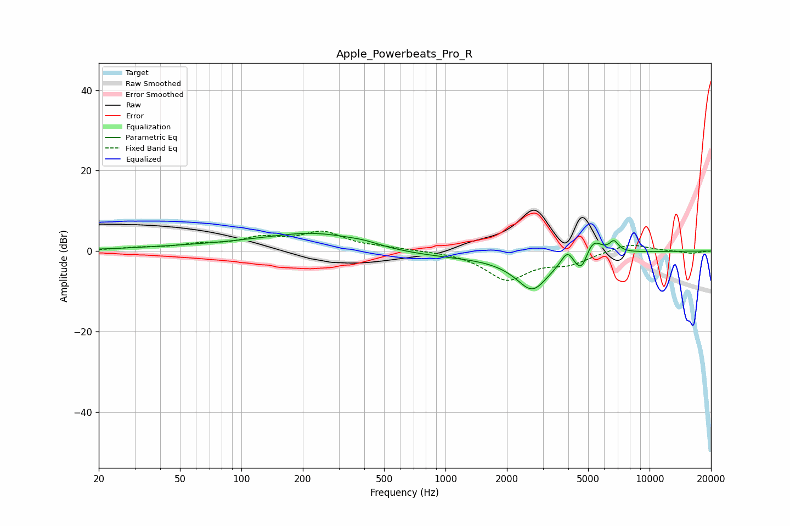

# Apple_Powerbeats_Pro_R
See [usage instructions](https://github.com/jaakkopasanen/AutoEq#usage) for more options and info.

### Parametric EQs
Apply preamp of -4.5 dB when using parametric equalizer.

|   # | Type    |   Fc (Hz) |    Q |   Gain (dB) |
|-----|---------|-----------|------|-------------|
|   1 | Peaking |        78 | 0.36 |         1.1 |
|   2 | Peaking |       243 | 0.57 |         4.4 |
|   3 | Peaking |       399 | 2.02 |         0.5 |
|   4 | Peaking |       877 | 0.34 |        -1.7 |
|   5 | Peaking |      2669 | 1.67 |        -8.8 |
|   6 | Peaking |      3947 | 4.88 |         3.1 |
|   7 | Peaking |      4396 | 6    |        -1.4 |
|   8 | Peaking |      4680 | 5.95 |        -3.2 |
|   9 | Peaking |      5316 | 3.45 |         3.8 |
|  10 | Peaking |      6692 | 6    |         2.6 |

### Fixed Band EQs
When using fixed band (also called graphic) equalizer, apply preamp of **-5.1 dB** (if available) and set gains manually with these parameters.

|   # | Type    |   Fc (Hz) |    Q |   Gain (dB) |
|-----|---------|-----------|------|-------------|
|   1 | Peaking |        31 | 1.41 |         0.7 |
|   2 | Peaking |        62 | 1.41 |         1.3 |
|   3 | Peaking |       125 | 1.41 |         2.8 |
|   4 | Peaking |       250 | 1.41 |         4.3 |
|   5 | Peaking |       500 | 1.41 |         0.6 |
|   6 | Peaking |      1000 | 1.41 |         0.1 |
|   7 | Peaking |      2000 | 1.41 |        -6.9 |
|   8 | Peaking |      4000 | 1.41 |        -2.7 |
|   9 | Peaking |      8000 | 1.41 |         2   |
|  10 | Peaking |     16000 | 1.41 |        -0.6 |

### Graphs

