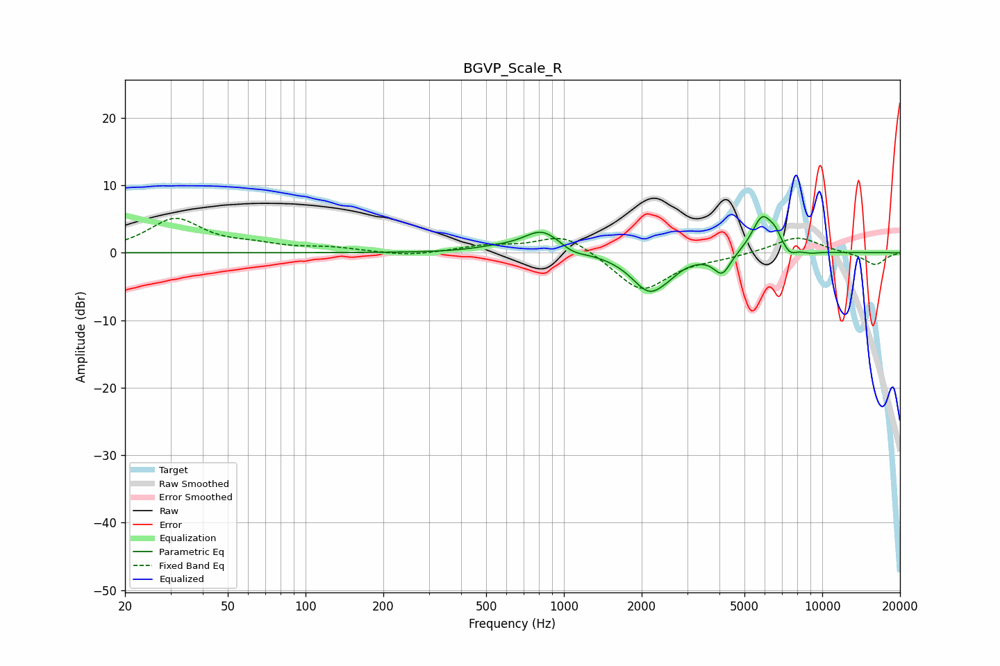

# BGVP_Scale_R
See [usage instructions](https://github.com/jaakkopasanen/AutoEq#usage) for more options and info.

### Parametric EQs
Apply preamp of -5.4 dB when using parametric equalizer.

|   # | Type    |   Fc (Hz) |    Q |   Gain (dB) |
|-----|---------|-----------|------|-------------|
|   1 | Peaking |       536 | 1.61 |         0.5 |
|   2 | Peaking |       825 | 1.91 |         3.4 |
|   3 | Peaking |      1079 | 3.05 |        -0.8 |
|   4 | Peaking |      2153 | 1.98 |        -5.7 |
|   5 | Peaking |      2580 | 3.94 |        -0.4 |
|   6 | Peaking |      4100 | 4.28 |        -3.1 |
|   7 | Peaking |      5862 | 3.33 |         5.5 |
|   8 | Peaking |      6571 | 6    |         1.4 |
|   9 | Peaking |      7492 | 5.56 |        -1.1 |
|  10 | Peaking |      8990 | 4.14 |        -0.3 |

### Fixed Band EQs
When using fixed band (also called graphic) equalizer, apply preamp of **-5.2 dB** (if available) and set gains manually with these parameters.

|   # | Type    |   Fc (Hz) |    Q |   Gain (dB) |
|-----|---------|-----------|------|-------------|
|   1 | Peaking |        31 | 1.41 |         4.9 |
|   2 | Peaking |        62 | 1.41 |         0.9 |
|   3 | Peaking |       125 | 1.41 |         0.6 |
|   4 | Peaking |       250 | 1.41 |        -0.5 |
|   5 | Peaking |       500 | 1.41 |         0.9 |
|   6 | Peaking |      1000 | 1.41 |         2.9 |
|   7 | Peaking |      2000 | 1.41 |        -5.8 |
|   8 | Peaking |      4000 | 1.41 |        -0.5 |
|   9 | Peaking |      8000 | 1.41 |         2.5 |
|  10 | Peaking |     16000 | 1.41 |        -1.8 |

### Graphs

