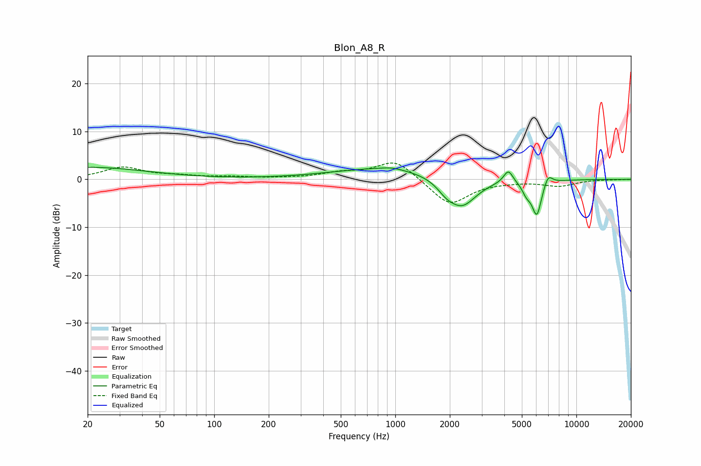

# Blon_A8_R
See [usage instructions](https://github.com/jaakkopasanen/AutoEq#usage) for more options and info.

### Parametric EQs
Apply preamp of -2.6 dB when using parametric equalizer.

|   # | Type    |   Fc (Hz) |    Q |   Gain (dB) |
|-----|---------|-----------|------|-------------|
|   1 | Peaking |        20 | 0.43 |         2.5 |
|   2 | Peaking |       940 | 0.46 |         2.5 |
|   3 | Peaking |       955 | 2.67 |         0.4 |
|   4 | Peaking |      1906 | 3.02 |        -1.6 |
|   5 | Peaking |      2329 | 1.71 |        -6.2 |
|   6 | Peaking |      4086 | 3.4  |         0.1 |
|   7 | Peaking |      4211 | 5.47 |         2.7 |
|   8 | Peaking |      5308 | 5.88 |        -1.9 |
|   9 | Peaking |      6047 | 5.01 |        -7.3 |
|  10 | Peaking |      6970 | 5.65 |         2.3 |

### Fixed Band EQs
When using fixed band (also called graphic) equalizer, apply preamp of **-3.5 dB** (if available) and set gains manually with these parameters.

|   # | Type    |   Fc (Hz) |    Q |   Gain (dB) |
|-----|---------|-----------|------|-------------|
|   1 | Peaking |        31 | 1.41 |         2.5 |
|   2 | Peaking |        62 | 1.41 |         0.6 |
|   3 | Peaking |       125 | 1.41 |         0.4 |
|   4 | Peaking |       250 | 1.41 |         0.2 |
|   5 | Peaking |       500 | 1.41 |         1.2 |
|   6 | Peaking |      1000 | 1.41 |         4.1 |
|   7 | Peaking |      2000 | 1.41 |        -5.5 |
|   8 | Peaking |      4000 | 1.41 |        -0.3 |
|   9 | Peaking |      8000 | 1.41 |        -1.3 |
|  10 | Peaking |     16000 | 1.41 |        -0   |

### Graphs

