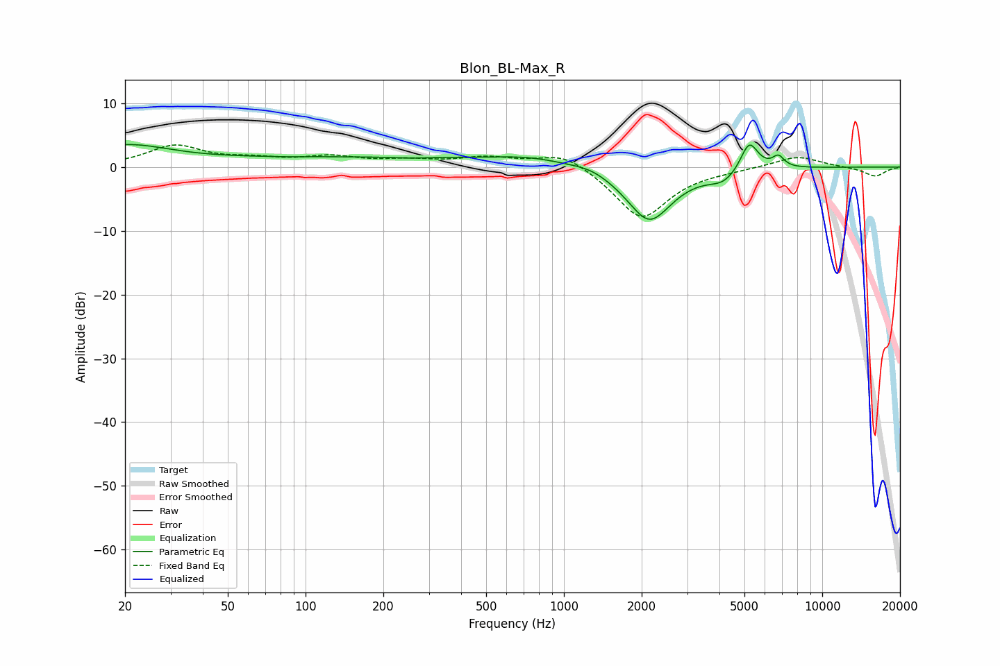

# Blon_BL-Max_R
See [usage instructions](https://github.com/jaakkopasanen/AutoEq#usage) for more options and info.

### Parametric EQs
Apply preamp of -3.6 dB when using parametric equalizer.

|   # | Type    |   Fc (Hz) |    Q |   Gain (dB) |
|-----|---------|-----------|------|-------------|
|   1 | Peaking |        20 | 0.82 |         3.1 |
|   2 | Peaking |        84 | 4.42 |        -0.1 |
|   3 | Peaking |       188 | 0.18 |         1.5 |
|   4 | Peaking |       252 | 2.19 |        -0.2 |
|   5 | Peaking |       743 | 1.07 |         0.8 |
|   6 | Peaking |      1275 | 1.95 |         0.7 |
|   7 | Peaking |      2140 | 1.56 |        -8.6 |
|   8 | Peaking |      4161 | 2.38 |        -1.8 |
|   9 | Peaking |      5215 | 3.99 |         4.8 |
|  10 | Peaking |      6763 | 6    |         1.7 |

### Fixed Band EQs
When using fixed band (also called graphic) equalizer, apply preamp of **-3.6 dB** (if available) and set gains manually with these parameters.

|   # | Type    |   Fc (Hz) |    Q |   Gain (dB) |
|-----|---------|-----------|------|-------------|
|   1 | Peaking |        31 | 1.41 |         3.2 |
|   2 | Peaking |        62 | 1.41 |         1   |
|   3 | Peaking |       125 | 1.41 |         1.4 |
|   4 | Peaking |       250 | 1.41 |         0.9 |
|   5 | Peaking |       500 | 1.41 |         1.3 |
|   6 | Peaking |      1000 | 1.41 |         2.5 |
|   7 | Peaking |      2000 | 1.41 |        -8.2 |
|   8 | Peaking |      4000 | 1.41 |        -0.3 |
|   9 | Peaking |      8000 | 1.41 |         1.8 |
|  10 | Peaking |     16000 | 1.41 |        -1.5 |

### Graphs

