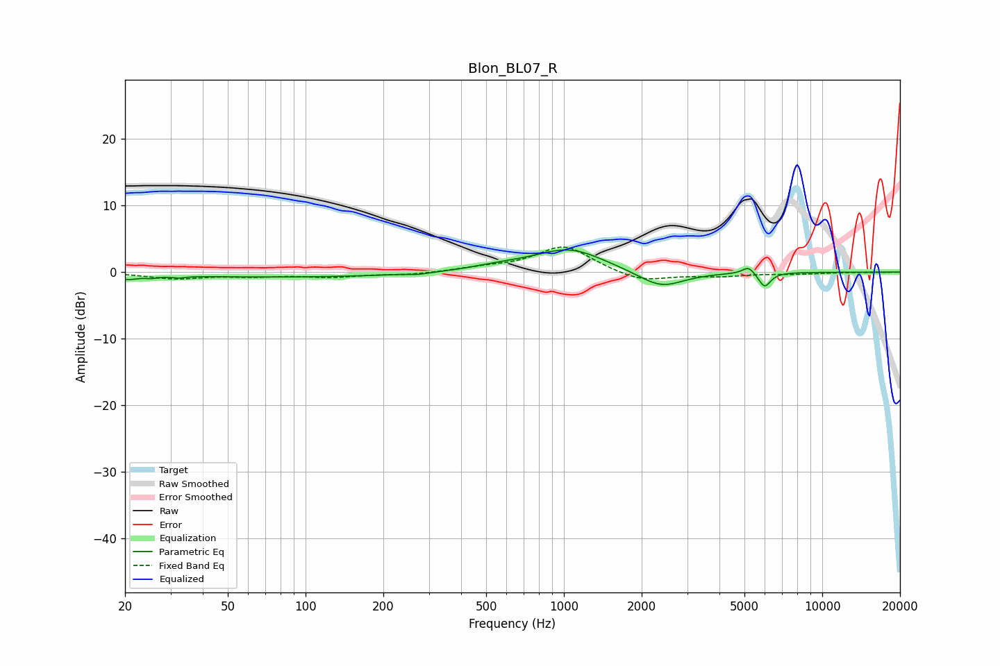

# Blon_BL07_R
See [usage instructions](https://github.com/jaakkopasanen/AutoEq#usage) for more options and info.

### Parametric EQs
Apply preamp of -3.4 dB when using parametric equalizer.

|   # | Type    |   Fc (Hz) |    Q |   Gain (dB) |
|-----|---------|-----------|------|-------------|
|   1 | Peaking |        21 | 4.05 |        -0.7 |
|   2 | Peaking |        25 | 5.07 |        -0.3 |
|   3 | Peaking |        32 | 5.62 |        -0.3 |
|   4 | Peaking |        84 | 0.29 |        -0.7 |
|   5 | Peaking |       274 | 4.17 |        -0.2 |
|   6 | Peaking |       562 | 1.34 |         0.6 |
|   7 | Peaking |      1049 | 1.04 |         3.5 |
|   8 | Peaking |      2377 | 1.58 |        -2.6 |
|   9 | Peaking |      5184 | 6    |         1.1 |
|  10 | Peaking |      5984 | 6    |        -2.2 |

### Fixed Band EQs
When using fixed band (also called graphic) equalizer, apply preamp of **-3.9 dB** (if available) and set gains manually with these parameters.

|   # | Type    |   Fc (Hz) |    Q |   Gain (dB) |
|-----|---------|-----------|------|-------------|
|   1 | Peaking |        31 | 1.41 |        -0.9 |
|   2 | Peaking |        62 | 1.41 |        -0.5 |
|   3 | Peaking |       125 | 1.41 |        -0.7 |
|   4 | Peaking |       250 | 1.41 |        -0.4 |
|   5 | Peaking |       500 | 1.41 |         0.5 |
|   6 | Peaking |      1000 | 1.41 |         4   |
|   7 | Peaking |      2000 | 1.41 |        -1.5 |
|   8 | Peaking |      4000 | 1.41 |        -0.6 |
|   9 | Peaking |      8000 | 1.41 |        -0.2 |
|  10 | Peaking |     16000 | 1.41 |        -0   |

### Graphs

