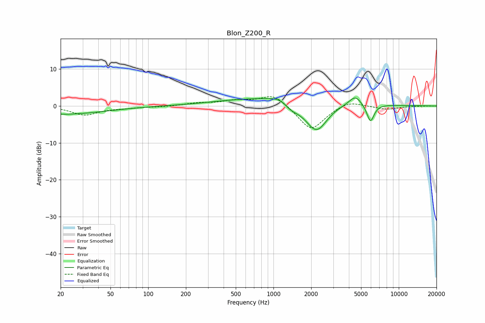

# Blon_Z200_R
See [usage instructions](https://github.com/jaakkopasanen/AutoEq#usage) for more options and info.

### Parametric EQs
Apply preamp of -2.2 dB when using parametric equalizer.

|   # | Type    |   Fc (Hz) |    Q |   Gain (dB) |
|-----|---------|-----------|------|-------------|
|   1 | Peaking |        21 | 0.42 |        -2.2 |
|   2 | Peaking |        22 | 4.43 |        -0.1 |
|   3 | Peaking |       286 | 0.56 |        -0.2 |
|   4 | Peaking |      1158 | 1.76 |         1.6 |
|   5 | Peaking |      1168 | 0.25 |         2.5 |
|   6 | Peaking |      1372 | 2.18 |        -2.2 |
|   7 | Peaking |      2141 | 1.39 |        -1.9 |
|   8 | Peaking |      2211 | 1.63 |        -6.7 |
|   9 | Peaking |      4495 | 2.94 |         2.5 |
|  10 | Peaking |      5940 | 4.67 |        -4.9 |

### Fixed Band EQs
When using fixed band (also called graphic) equalizer, apply preamp of **-2.6 dB** (if available) and set gains manually with these parameters.

|   # | Type    |   Fc (Hz) |    Q |   Gain (dB) |
|-----|---------|-----------|------|-------------|
|   1 | Peaking |        31 | 1.41 |        -2.4 |
|   2 | Peaking |        62 | 1.41 |        -0.4 |
|   3 | Peaking |       125 | 1.41 |        -0.2 |
|   4 | Peaking |       250 | 1.41 |         0.7 |
|   5 | Peaking |       500 | 1.41 |         1.3 |
|   6 | Peaking |      1000 | 1.41 |         3.4 |
|   7 | Peaking |      2000 | 1.41 |        -6.8 |
|   8 | Peaking |      4000 | 1.41 |         1.7 |
|   9 | Peaking |      8000 | 1.41 |        -0.9 |
|  10 | Peaking |     16000 | 1.41 |         0   |

### Graphs

