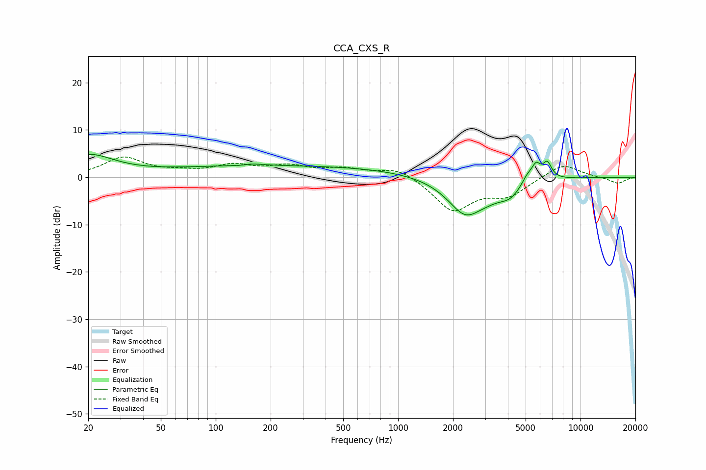

# CCA_CXS_R
See [usage instructions](https://github.com/jaakkopasanen/AutoEq#usage) for more options and info.

### Parametric EQs
Apply preamp of -4.9 dB when using parametric equalizer.

|   # | Type    |   Fc (Hz) |    Q |   Gain (dB) |
|-----|---------|-----------|------|-------------|
|   1 | Peaking |        20 | 1    |         4.4 |
|   2 | Peaking |       135 | 3.4  |        -0.3 |
|   3 | Peaking |       151 | 2    |         0.6 |
|   4 | Peaking |       245 | 0.18 |         2.4 |
|   5 | Peaking |      2341 | 1.41 |        -7.8 |
|   6 | Peaking |      3128 | 2    |        -1.1 |
|   7 | Peaking |      4098 | 2.16 |        -2.8 |
|   8 | Peaking |      5121 | 4.29 |         1.9 |
|   9 | Peaking |      5717 | 5.87 |         3   |
|  10 | Peaking |      6567 | 5.53 |         3.4 |

### Fixed Band EQs
When using fixed band (also called graphic) equalizer, apply preamp of **-4.4 dB** (if available) and set gains manually with these parameters.

|   # | Type    |   Fc (Hz) |    Q |   Gain (dB) |
|-----|---------|-----------|------|-------------|
|   1 | Peaking |        31 | 1.41 |         4   |
|   2 | Peaking |        62 | 1.41 |         0.8 |
|   3 | Peaking |       125 | 1.41 |         2.2 |
|   4 | Peaking |       250 | 1.41 |         2   |
|   5 | Peaking |       500 | 1.41 |         1.6 |
|   6 | Peaking |      1000 | 1.41 |         2.2 |
|   7 | Peaking |      2000 | 1.41 |        -7   |
|   8 | Peaking |      4000 | 1.41 |        -3.5 |
|   9 | Peaking |      8000 | 1.41 |         3   |
|  10 | Peaking |     16000 | 1.41 |        -1.3 |

### Graphs

