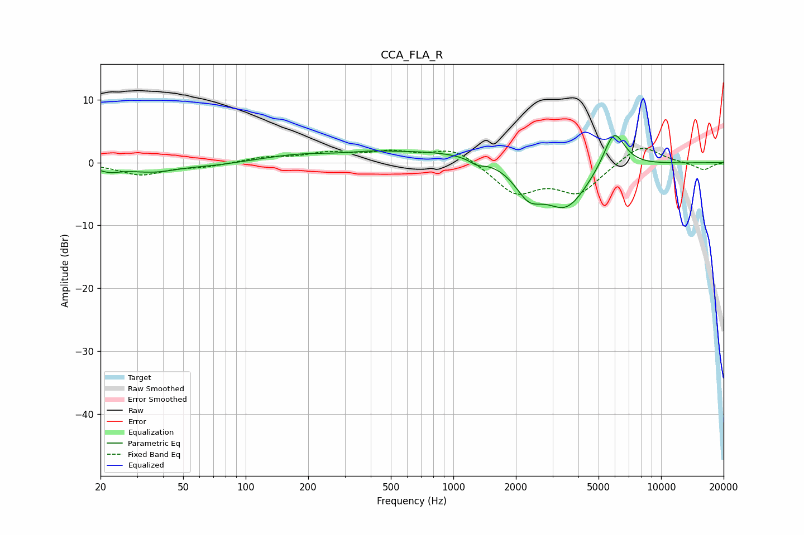

# CCA_FLA_R
See [usage instructions](https://github.com/jaakkopasanen/AutoEq#usage) for more options and info.

### Parametric EQs
Apply preamp of -4.4 dB when using parametric equalizer.

|   # | Type    |   Fc (Hz) |    Q |   Gain (dB) |
|-----|---------|-----------|------|-------------|
|   1 | Peaking |        22 | 2.6  |        -1   |
|   2 | Peaking |        36 | 1.09 |        -1.4 |
|   3 | Peaking |        72 | 1.4  |        -0.3 |
|   4 | Peaking |       179 | 0.85 |         1   |
|   5 | Peaking |       400 | 1.32 |         0.4 |
|   6 | Peaking |       877 | 0.4  |         1.9 |
|   7 | Peaking |      1300 | 3.9  |        -0.9 |
|   8 | Peaking |      2304 | 2.12 |        -4.2 |
|   9 | Peaking |      3491 | 1.27 |        -7.3 |
|  10 | Peaking |      5933 | 2.57 |         6.5 |

### Fixed Band EQs
When using fixed band (also called graphic) equalizer, apply preamp of **-2.4 dB** (if available) and set gains manually with these parameters.

|   # | Type    |   Fc (Hz) |    Q |   Gain (dB) |
|-----|---------|-----------|------|-------------|
|   1 | Peaking |        31 | 1.41 |        -1.9 |
|   2 | Peaking |        62 | 1.41 |        -0.6 |
|   3 | Peaking |       125 | 1.41 |         0.8 |
|   4 | Peaking |       250 | 1.41 |         1.4 |
|   5 | Peaking |       500 | 1.41 |         1.5 |
|   6 | Peaking |      1000 | 1.41 |         2.4 |
|   7 | Peaking |      2000 | 1.41 |        -4.7 |
|   8 | Peaking |      4000 | 1.41 |        -4.6 |
|   9 | Peaking |      8000 | 1.41 |         3.1 |
|  10 | Peaking |     16000 | 1.41 |        -1.2 |

### Graphs

