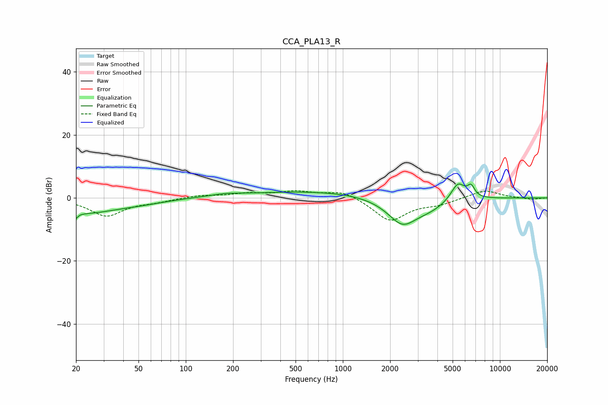

# CCA_PLA13_R
See [usage instructions](https://github.com/jaakkopasanen/AutoEq#usage) for more options and info.

### Parametric EQs
Apply preamp of -4.5 dB when using parametric equalizer.

|   # | Type    |   Fc (Hz) |    Q |   Gain (dB) |
|-----|---------|-----------|------|-------------|
|   1 | Peaking |        20 | 5.77 |        -5.2 |
|   2 | Peaking |        20 | 5.98 |         3.1 |
|   3 | Peaking |        23 | 0.74 |        -4.3 |
|   4 | Peaking |        51 | 0.85 |        -1.1 |
|   5 | Peaking |       177 | 1.49 |         0.7 |
|   6 | Peaking |       711 | 0.29 |         2.2 |
|   7 | Peaking |      2395 | 1.41 |        -8.6 |
|   8 | Peaking |      3629 | 1.28 |        -2.5 |
|   9 | Peaking |      5401 | 3.02 |         5.8 |
|  10 | Peaking |      6553 | 5.89 |         3.3 |

### Fixed Band EQs
When using fixed band (also called graphic) equalizer, apply preamp of **-2.4 dB** (if available) and set gains manually with these parameters.

|   # | Type    |   Fc (Hz) |    Q |   Gain (dB) |
|-----|---------|-----------|------|-------------|
|   1 | Peaking |        31 | 1.41 |        -5.6 |
|   2 | Peaking |        62 | 1.41 |        -1   |
|   3 | Peaking |       125 | 1.41 |         0.8 |
|   4 | Peaking |       250 | 1.41 |         1.3 |
|   5 | Peaking |       500 | 1.41 |         1.9 |
|   6 | Peaking |      1000 | 1.41 |         2.4 |
|   7 | Peaking |      2000 | 1.41 |        -7.3 |
|   8 | Peaking |      4000 | 1.41 |        -1.7 |
|   9 | Peaking |      8000 | 1.41 |         2.6 |
|  10 | Peaking |     16000 | 1.41 |        -0.5 |

### Graphs

