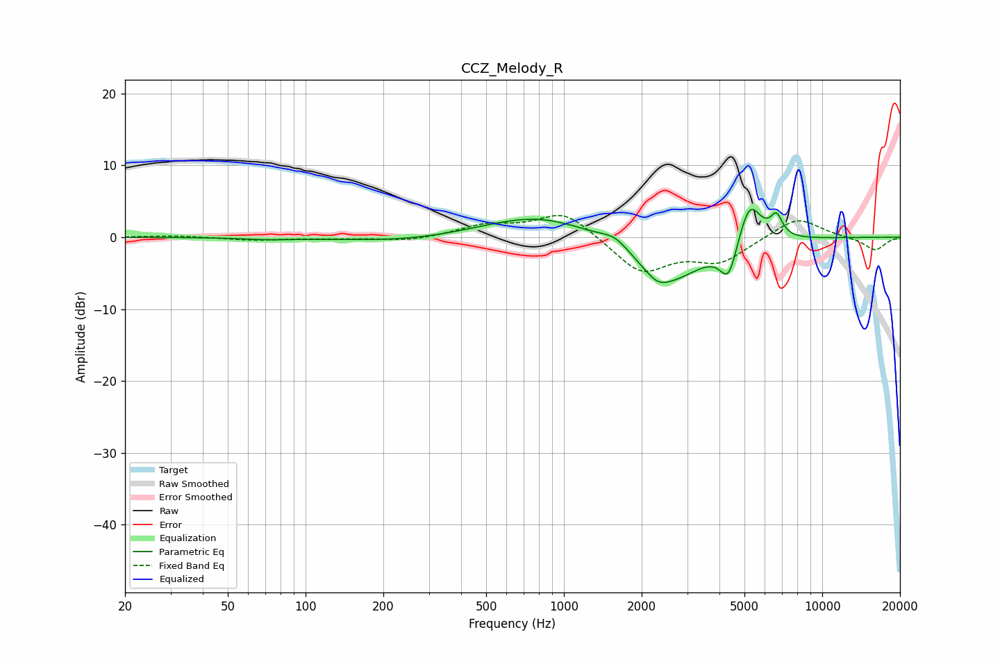

# CCZ_Melody_R
See [usage instructions](https://github.com/jaakkopasanen/AutoEq#usage) for more options and info.

### Parametric EQs
Apply preamp of -4.0 dB when using parametric equalizer.

|   # | Type    |   Fc (Hz) |    Q |   Gain (dB) |
|-----|---------|-----------|------|-------------|
|   1 | Peaking |        72 | 1.52 |        -0.2 |
|   2 | Peaking |       265 | 0.57 |        -0.8 |
|   3 | Peaking |       383 | 0.99 |         0.1 |
|   4 | Peaking |       802 | 0.64 |         3.3 |
|   5 | Peaking |      1580 | 2.55 |         1.5 |
|   6 | Peaking |      2303 | 3.22 |        -1.2 |
|   7 | Peaking |      2525 | 0.98 |        -6.3 |
|   8 | Peaking |      4344 | 4.24 |        -5   |
|   9 | Peaking |      5230 | 3.06 |         6.3 |
|  10 | Peaking |      6652 | 6    |         2.9 |

### Fixed Band EQs
When using fixed band (also called graphic) equalizer, apply preamp of **-3.1 dB** (if available) and set gains manually with these parameters.

|   # | Type    |   Fc (Hz) |    Q |   Gain (dB) |
|-----|---------|-----------|------|-------------|
|   1 | Peaking |        31 | 1.41 |         0.2 |
|   2 | Peaking |        62 | 1.41 |        -0.4 |
|   3 | Peaking |       125 | 1.41 |        -0.2 |
|   4 | Peaking |       250 | 1.41 |        -0.6 |
|   5 | Peaking |       500 | 1.41 |         1.5 |
|   6 | Peaking |      1000 | 1.41 |         3.7 |
|   7 | Peaking |      2000 | 1.41 |        -4.9 |
|   8 | Peaking |      4000 | 1.41 |        -3.2 |
|   9 | Peaking |      8000 | 1.41 |         2.9 |
|  10 | Peaking |     16000 | 1.41 |        -1.8 |

### Graphs

