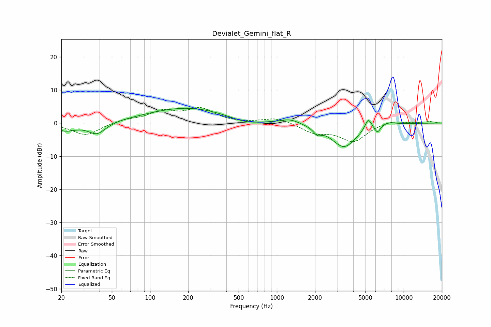

# Devialet_Gemini_flat_R
See [usage instructions](https://github.com/jaakkopasanen/AutoEq#usage) for more options and info.

### Parametric EQs
Apply preamp of -4.5 dB when using parametric equalizer.

|   # | Type    |   Fc (Hz) |    Q |   Gain (dB) |
|-----|---------|-----------|------|-------------|
|   1 | Peaking |        21 | 1.67 |        -2.2 |
|   2 | Peaking |        38 | 2.07 |        -3.6 |
|   3 | Peaking |       197 | 0.44 |         4.7 |
|   4 | Peaking |       566 | 1.17 |        -1.6 |
|   5 | Peaking |      1275 | 1.93 |         1.4 |
|   6 | Peaking |      2083 | 4.72 |        -1.8 |
|   7 | Peaking |      3383 | 1.42 |        -7.3 |
|   8 | Peaking |      5249 | 5.31 |         3.5 |
|   9 | Peaking |      6212 | 6    |        -2.3 |
|  10 | Peaking |      7516 | 2.24 |         0.9 |

### Fixed Band EQs
When using fixed band (also called graphic) equalizer, apply preamp of **-4.8 dB** (if available) and set gains manually with these parameters.

|   # | Type    |   Fc (Hz) |    Q |   Gain (dB) |
|-----|---------|-----------|------|-------------|
|   1 | Peaking |        31 | 1.41 |        -3.7 |
|   2 | Peaking |        62 | 1.41 |         1   |
|   3 | Peaking |       125 | 1.41 |         3.2 |
|   4 | Peaking |       250 | 1.41 |         4.1 |
|   5 | Peaking |       500 | 1.41 |        -0   |
|   6 | Peaking |      1000 | 1.41 |         1.7 |
|   7 | Peaking |      2000 | 1.41 |        -2.7 |
|   8 | Peaking |      4000 | 1.41 |        -5.4 |
|   9 | Peaking |      8000 | 1.41 |         1   |
|  10 | Peaking |     16000 | 1.41 |         0.5 |

### Graphs

