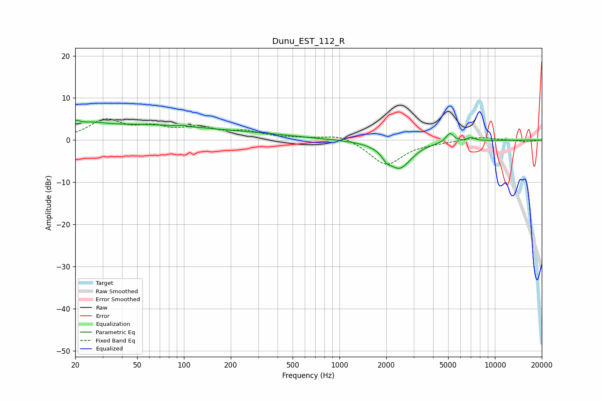

# Dunu_EST_112_R
See [usage instructions](https://github.com/jaakkopasanen/AutoEq#usage) for more options and info.

### Parametric EQs
Apply preamp of -4.8 dB when using parametric equalizer.

|   # | Type    |   Fc (Hz) |    Q |   Gain (dB) |
|-----|---------|-----------|------|-------------|
|   1 | Peaking |        20 | 5.94 |         1.3 |
|   2 | Peaking |        25 | 1.52 |         1.3 |
|   3 | Peaking |        54 | 0.29 |         3.5 |
|   4 | Peaking |        99 | 5.99 |         2.1 |
|   5 | Peaking |        99 | 5.63 |        -1.9 |
|   6 | Peaking |       327 | 0.57 |         0.8 |
|   7 | Peaking |      2006 | 5.58 |        -1.4 |
|   8 | Peaking |      2431 | 1.84 |        -6.5 |
|   9 | Peaking |      5133 | 5.83 |         2.2 |
|  10 | Peaking |      7008 | 5.69 |         0.8 |

### Fixed Band EQs
When using fixed band (also called graphic) equalizer, apply preamp of **-5.1 dB** (if available) and set gains manually with these parameters.

|   # | Type    |   Fc (Hz) |    Q |   Gain (dB) |
|-----|---------|-----------|------|-------------|
|   1 | Peaking |        31 | 1.41 |         4.5 |
|   2 | Peaking |        62 | 1.41 |         2.5 |
|   3 | Peaking |       125 | 1.41 |         2.5 |
|   4 | Peaking |       250 | 1.41 |         1.7 |
|   5 | Peaking |       500 | 1.41 |         0.4 |
|   6 | Peaking |      1000 | 1.41 |         1.5 |
|   7 | Peaking |      2000 | 1.41 |        -6   |
|   8 | Peaking |      4000 | 1.41 |        -0.4 |
|   9 | Peaking |      8000 | 1.41 |         0.8 |
|  10 | Peaking |     16000 | 1.41 |        -0.4 |

### Graphs

