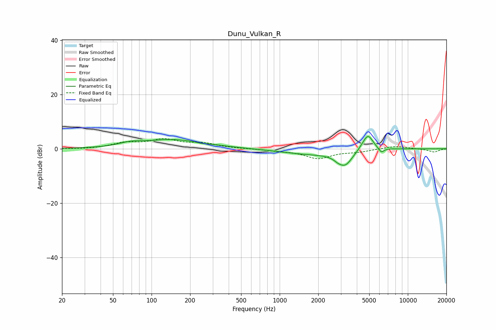

# Dunu_Vulkan_R
See [usage instructions](https://github.com/jaakkopasanen/AutoEq#usage) for more options and info.

### Parametric EQs
Apply preamp of -4.6 dB when using parametric equalizer.

|   # | Type    |   Fc (Hz) |    Q |   Gain (dB) |
|-----|---------|-----------|------|-------------|
|   1 | Peaking |        68 | 1.57 |         1.4 |
|   2 | Peaking |       157 | 0.66 |         3.6 |
|   3 | Peaking |       173 | 1.74 |        -0.4 |
|   4 | Peaking |       243 | 3.33 |        -0.4 |
|   5 | Peaking |      1700 | 0.64 |        -1.8 |
|   6 | Peaking |      2817 | 5.99 |        -0.4 |
|   7 | Peaking |      3218 | 2.27 |        -5.7 |
|   8 | Peaking |      4816 | 2.92 |         5.4 |
|   9 | Peaking |      4980 | 5.6  |         0.9 |
|  10 | Peaking |      6204 | 6    |        -1.9 |

### Fixed Band EQs
When using fixed band (also called graphic) equalizer, apply preamp of **-3.8 dB** (if available) and set gains manually with these parameters.

|   # | Type    |   Fc (Hz) |    Q |   Gain (dB) |
|-----|---------|-----------|------|-------------|
|   1 | Peaking |        31 | 1.41 |        -0.2 |
|   2 | Peaking |        62 | 1.41 |         2   |
|   3 | Peaking |       125 | 1.41 |         3.1 |
|   4 | Peaking |       250 | 1.41 |         1.8 |
|   5 | Peaking |       500 | 1.41 |         0   |
|   6 | Peaking |      1000 | 1.41 |        -0.6 |
|   7 | Peaking |      2000 | 1.41 |        -3.4 |
|   8 | Peaking |      4000 | 1.41 |        -0.9 |
|   9 | Peaking |      8000 | 1.41 |         1   |
|  10 | Peaking |     16000 | 1.41 |        -1.2 |

### Graphs

