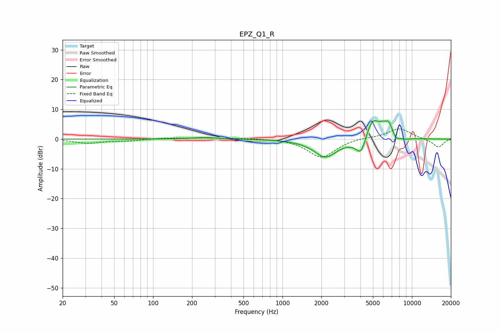

# EPZ_Q1_R
See [usage instructions](https://github.com/jaakkopasanen/AutoEq#usage) for more options and info.

### Parametric EQs
Apply preamp of -6.3 dB when using parametric equalizer.

|   # | Type    |   Fc (Hz) |    Q |   Gain (dB) |
|-----|---------|-----------|------|-------------|
|   1 | Peaking |       248 | 1.5  |         0.6 |
|   2 | Peaking |      2147 | 1.58 |        -6.1 |
|   3 | Peaking |      3854 | 1.91 |        -0.9 |
|   4 | Peaking |      4054 | 3.61 |        -5.7 |
|   5 | Peaking |      4899 | 3.31 |         1.3 |
|   6 | Peaking |      4986 | 2.24 |         6.7 |
|   7 | Peaking |      5946 | 5.99 |         1.2 |
|   8 | Peaking |      6614 | 4.34 |         4.4 |
|   9 | Peaking |      7539 | 4.85 |        -1.8 |
|  10 | Peaking |      8941 | 3.43 |        -0.5 |

### Fixed Band EQs
When using fixed band (also called graphic) equalizer, apply preamp of **-3.5 dB** (if available) and set gains manually with these parameters.

|   # | Type    |   Fc (Hz) |    Q |   Gain (dB) |
|-----|---------|-----------|------|-------------|
|   1 | Peaking |        31 | 1.41 |        -1.3 |
|   2 | Peaking |        62 | 1.41 |        -0.5 |
|   3 | Peaking |       125 | 1.41 |         0.3 |
|   4 | Peaking |       250 | 1.41 |         0.4 |
|   5 | Peaking |       500 | 1.41 |         0.3 |
|   6 | Peaking |      1000 | 1.41 |         0.2 |
|   7 | Peaking |      2000 | 1.41 |        -6.2 |
|   8 | Peaking |      4000 | 1.41 |         0.5 |
|   9 | Peaking |      8000 | 1.41 |         3.6 |
|  10 | Peaking |     16000 | 1.41 |        -2.8 |

### Graphs

