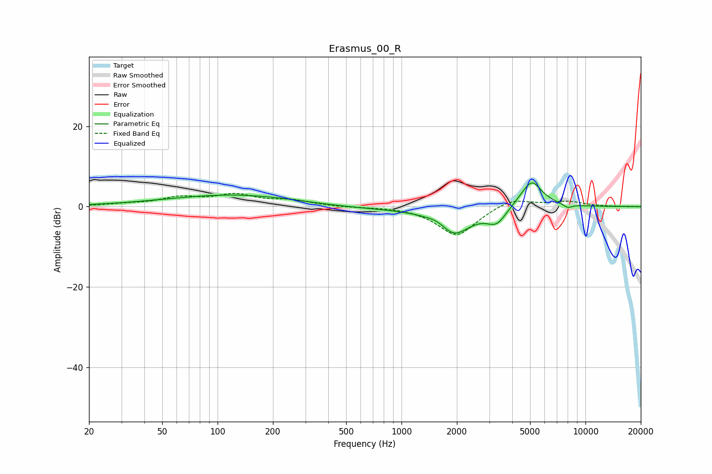

# Erasmus_00_R
See [usage instructions](https://github.com/jaakkopasanen/AutoEq#usage) for more options and info.

### Parametric EQs
Apply preamp of -6.0 dB when using parametric equalizer.

|   # | Type    |   Fc (Hz) |    Q |   Gain (dB) |
|-----|---------|-----------|------|-------------|
|   1 | Peaking |        51 | 0.39 |         0.3 |
|   2 | Peaking |       133 | 0.4  |         2.9 |
|   3 | Peaking |       548 | 0.42 |        -0.7 |
|   4 | Peaking |      1603 | 2.38 |         1.5 |
|   5 | Peaking |      1909 | 1.51 |        -7.1 |
|   6 | Peaking |      3294 | 2.61 |        -3.8 |
|   7 | Peaking |      5038 | 2.01 |         5.9 |
|   8 | Peaking |      5169 | 4.45 |         1.2 |
|   9 | Peaking |      8019 | 5.67 |        -1.5 |
|  10 | Peaking |      8041 | 5.99 |         0.6 |

### Fixed Band EQs
When using fixed band (also called graphic) equalizer, apply preamp of **-3.4 dB** (if available) and set gains manually with these parameters.

|   # | Type    |   Fc (Hz) |    Q |   Gain (dB) |
|-----|---------|-----------|------|-------------|
|   1 | Peaking |        31 | 1.41 |         0.5 |
|   2 | Peaking |        62 | 1.41 |         2   |
|   3 | Peaking |       125 | 1.41 |         2.7 |
|   4 | Peaking |       250 | 1.41 |         1.4 |
|   5 | Peaking |       500 | 1.41 |        -0.1 |
|   6 | Peaking |      1000 | 1.41 |         0.1 |
|   7 | Peaking |      2000 | 1.41 |        -7.3 |
|   8 | Peaking |      4000 | 1.41 |         2.3 |
|   9 | Peaking |      8000 | 1.41 |         1.2 |
|  10 | Peaking |     16000 | 1.41 |         0   |

### Graphs

