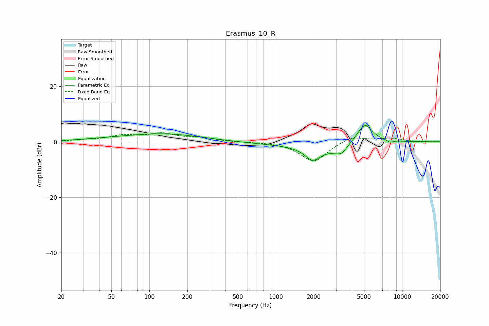

# Erasmus_10_R
See [usage instructions](https://github.com/jaakkopasanen/AutoEq#usage) for more options and info.

### Parametric EQs
Apply preamp of -6.0 dB when using parametric equalizer.

|   # | Type    |   Fc (Hz) |    Q |   Gain (dB) |
|-----|---------|-----------|------|-------------|
|   1 | Peaking |        47 | 0.65 |         0.6 |
|   2 | Peaking |       131 | 0.49 |         2.7 |
|   3 | Peaking |       941 | 0.63 |        -0.7 |
|   4 | Peaking |      1747 | 2.28 |         1.8 |
|   5 | Peaking |      1917 | 1.84 |        -7.5 |
|   6 | Peaking |      3237 | 2.12 |        -3.7 |
|   7 | Peaking |      3367 | 5.97 |        -0.5 |
|   8 | Peaking |      5042 | 2.13 |         6.4 |
|   9 | Peaking |      5200 | 4.47 |         0.7 |
|  10 | Peaking |      8012 | 5.78 |        -0.9 |

### Fixed Band EQs
When using fixed band (also called graphic) equalizer, apply preamp of **-3.4 dB** (if available) and set gains manually with these parameters.

|   # | Type    |   Fc (Hz) |    Q |   Gain (dB) |
|-----|---------|-----------|------|-------------|
|   1 | Peaking |        31 | 1.41 |         0.5 |
|   2 | Peaking |        62 | 1.41 |         2   |
|   3 | Peaking |       125 | 1.41 |         2.6 |
|   4 | Peaking |       250 | 1.41 |         1.4 |
|   5 | Peaking |       500 | 1.41 |        -0.1 |
|   6 | Peaking |      1000 | 1.41 |         0   |
|   7 | Peaking |      2000 | 1.41 |        -7.3 |
|   8 | Peaking |      4000 | 1.41 |         2.3 |
|   9 | Peaking |      8000 | 1.41 |         1.2 |
|  10 | Peaking |     16000 | 1.41 |        -0   |

### Graphs

