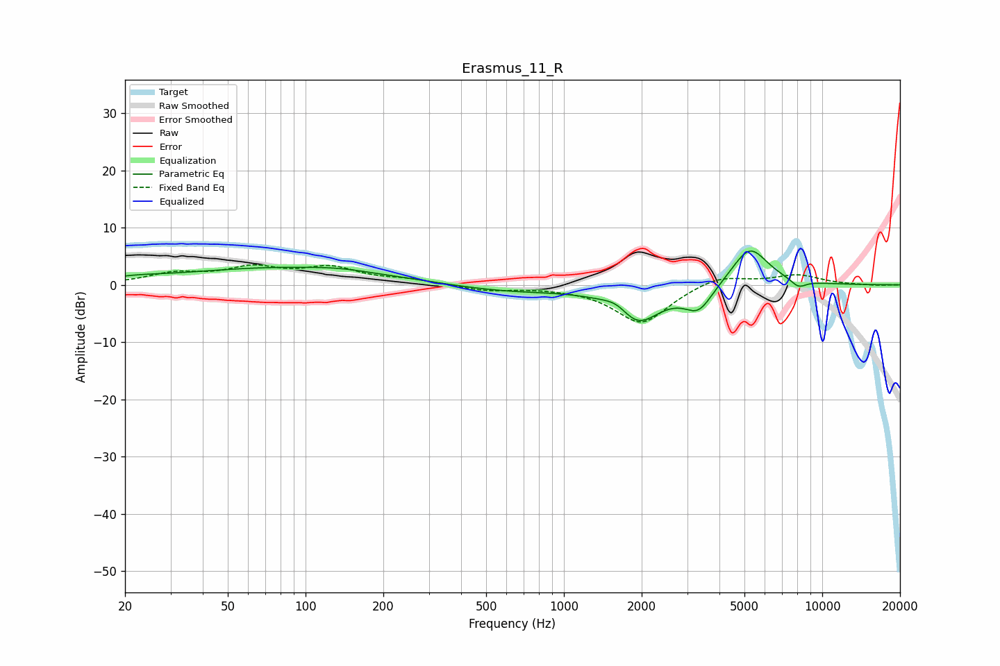

# Erasmus_11_R
See [usage instructions](https://github.com/jaakkopasanen/AutoEq#usage) for more options and info.

### Parametric EQs
Apply preamp of -6.0 dB when using parametric equalizer.

|   # | Type    |   Fc (Hz) |    Q |   Gain (dB) |
|-----|---------|-----------|------|-------------|
|   1 | Peaking |        20 | 4.01 |         0   |
|   2 | Peaking |        22 | 1.35 |         0.5 |
|   3 | Peaking |        83 | 0.35 |         3   |
|   4 | Peaking |       135 | 1.37 |         0.4 |
|   5 | Peaking |       603 | 0.6  |        -1.2 |
|   6 | Peaking |      1611 | 2.64 |         1.8 |
|   7 | Peaking |      1917 | 1.58 |        -6.7 |
|   8 | Peaking |      3323 | 2.55 |        -4.3 |
|   9 | Peaking |      5241 | 1.92 |         7   |
|  10 | Peaking |      8092 | 4.36 |        -1.4 |

### Fixed Band EQs
When using fixed band (also called graphic) equalizer, apply preamp of **-3.6 dB** (if available) and set gains manually with these parameters.

|   # | Type    |   Fc (Hz) |    Q |   Gain (dB) |
|-----|---------|-----------|------|-------------|
|   1 | Peaking |        31 | 1.41 |         1.8 |
|   2 | Peaking |        62 | 1.41 |         2.6 |
|   3 | Peaking |       125 | 1.41 |         2.7 |
|   4 | Peaking |       250 | 1.41 |         0.8 |
|   5 | Peaking |       500 | 1.41 |        -1   |
|   6 | Peaking |      1000 | 1.41 |        -0.2 |
|   7 | Peaking |      2000 | 1.41 |        -6.8 |
|   8 | Peaking |      4000 | 1.41 |         1.9 |
|   9 | Peaking |      8000 | 1.41 |         1.7 |
|  10 | Peaking |     16000 | 1.41 |        -0.1 |

### Graphs

