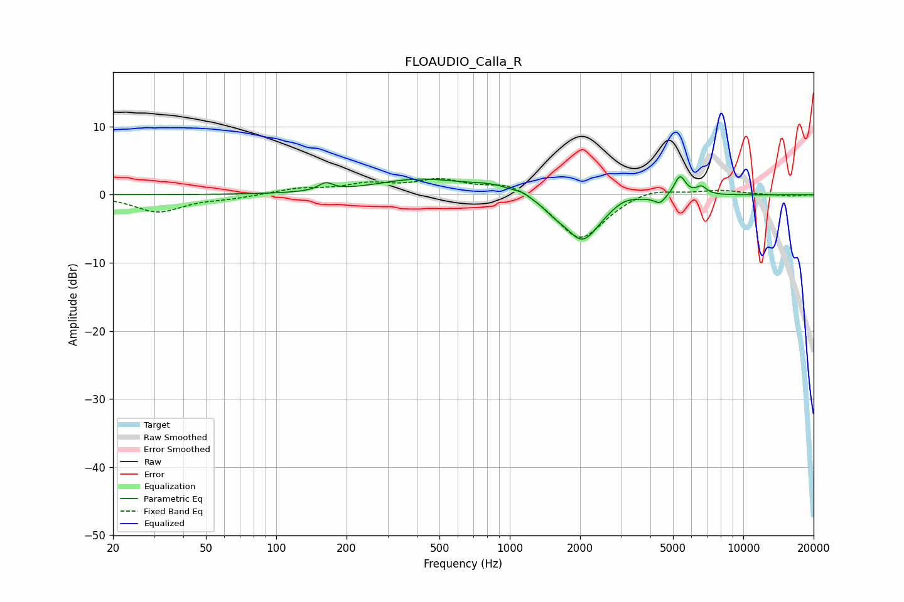

# FLOAUDIO_Calla_R
See [usage instructions](https://github.com/jaakkopasanen/AutoEq#usage) for more options and info.

### Parametric EQs
Apply preamp of -2.7 dB when using parametric equalizer.

|   # | Type    |   Fc (Hz) |    Q |   Gain (dB) |
|-----|---------|-----------|------|-------------|
|   1 | Peaking |       163 | 4.69 |         1.1 |
|   2 | Peaking |       412 | 0.74 |         2.2 |
|   3 | Peaking |       854 | 1.47 |         1.1 |
|   4 | Peaking |      1133 | 4.74 |         0.4 |
|   5 | Peaking |      1540 | 3.28 |        -0.8 |
|   6 | Peaking |      2046 | 1.82 |        -6.8 |
|   7 | Peaking |      3099 | 2.74 |         0.8 |
|   8 | Peaking |      4397 | 5.98 |        -1.1 |
|   9 | Peaking |      5355 | 5.78 |         3   |
|  10 | Peaking |      6623 | 6    |         1.2 |

### Fixed Band EQs
When using fixed band (also called graphic) equalizer, apply preamp of **-2.5 dB** (if available) and set gains manually with these parameters.

|   # | Type    |   Fc (Hz) |    Q |   Gain (dB) |
|-----|---------|-----------|------|-------------|
|   1 | Peaking |        31 | 1.41 |        -2.5 |
|   2 | Peaking |        62 | 1.41 |        -0.5 |
|   3 | Peaking |       125 | 1.41 |         0.8 |
|   4 | Peaking |       250 | 1.41 |         1.4 |
|   5 | Peaking |       500 | 1.41 |         2   |
|   6 | Peaking |      1000 | 1.41 |         2   |
|   7 | Peaking |      2000 | 1.41 |        -6.9 |
|   8 | Peaking |      4000 | 1.41 |         1.2 |
|   9 | Peaking |      8000 | 1.41 |         0.7 |
|  10 | Peaking |     16000 | 1.41 |        -0.2 |

### Graphs

