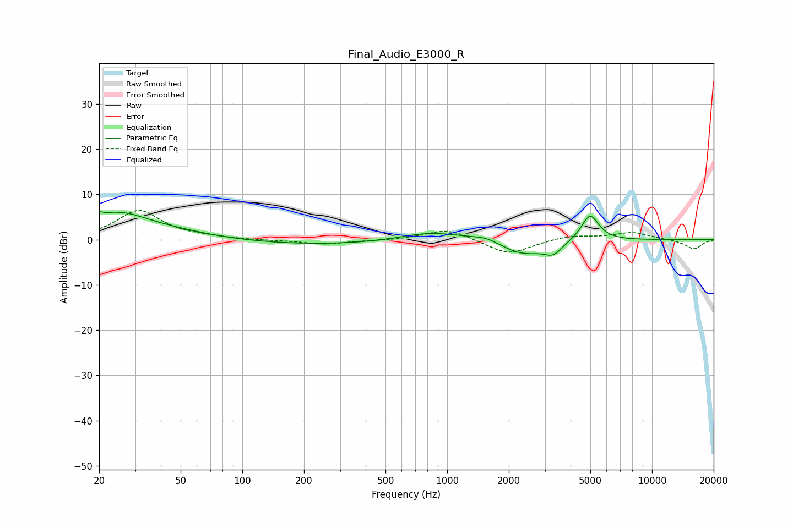

# Final_Audio_E3000_R
See [usage instructions](https://github.com/jaakkopasanen/AutoEq#usage) for more options and info.

### Parametric EQs
Apply preamp of -6.2 dB when using parametric equalizer.

|   # | Type    |   Fc (Hz) |    Q |   Gain (dB) |
|-----|---------|-----------|------|-------------|
|   1 | Peaking |        21 | 5.26 |         3.5 |
|   2 | Peaking |        21 | 5.93 |        -2.9 |
|   3 | Peaking |        22 | 0.39 |         4.8 |
|   4 | Peaking |        27 | 1.51 |         1.5 |
|   5 | Peaking |       183 | 0.2  |        -1.3 |
|   6 | Peaking |       836 | 0.87 |         2.3 |
|   7 | Peaking |      1551 | 2.09 |         1.1 |
|   8 | Peaking |      2332 | 1.25 |        -3.3 |
|   9 | Peaking |      3297 | 3.26 |        -2.3 |
|  10 | Peaking |      4978 | 3.25 |         5.9 |

### Fixed Band EQs
When using fixed band (also called graphic) equalizer, apply preamp of **-6.5 dB** (if available) and set gains manually with these parameters.

|   # | Type    |   Fc (Hz) |    Q |   Gain (dB) |
|-----|---------|-----------|------|-------------|
|   1 | Peaking |        31 | 1.41 |         6.4 |
|   2 | Peaking |        62 | 1.41 |         0.4 |
|   3 | Peaking |       125 | 1.41 |        -0.2 |
|   4 | Peaking |       250 | 1.41 |        -1   |
|   5 | Peaking |       500 | 1.41 |        -0.2 |
|   6 | Peaking |      1000 | 1.41 |         2.4 |
|   7 | Peaking |      2000 | 1.41 |        -3.4 |
|   8 | Peaking |      4000 | 1.41 |         0.9 |
|   9 | Peaking |      8000 | 1.41 |         1.6 |
|  10 | Peaking |     16000 | 1.41 |        -2.1 |

### Graphs

