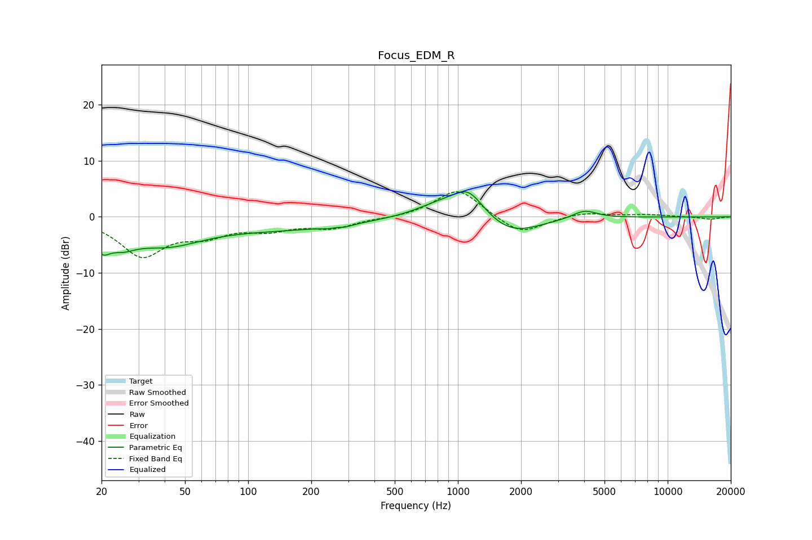

# Focus_EDM_R
See [usage instructions](https://github.com/jaakkopasanen/AutoEq#usage) for more options and info.

### Parametric EQs
Apply preamp of -4.6 dB when using parametric equalizer.

|   # | Type    |   Fc (Hz) |    Q |   Gain (dB) |
|-----|---------|-----------|------|-------------|
|   1 | Peaking |        20 | 3.86 |        -3.4 |
|   2 | Peaking |        25 | 2.09 |        -2.6 |
|   3 | Peaking |        40 | 0.8  |        -4.2 |
|   4 | Peaking |       146 | 0.41 |        -2   |
|   5 | Peaking |       266 | 4.62 |         2.2 |
|   6 | Peaking |       267 | 3.83 |        -2.6 |
|   7 | Peaking |       818 | 1.19 |         2.2 |
|   8 | Peaking |      1122 | 1.86 |         4.8 |
|   9 | Peaking |      1789 | 1.05 |        -3.4 |
|  10 | Peaking |      4015 | 2.43 |         1.5 |

### Fixed Band EQs
When using fixed band (also called graphic) equalizer, apply preamp of **-4.6 dB** (if available) and set gains manually with these parameters.

|   # | Type    |   Fc (Hz) |    Q |   Gain (dB) |
|-----|---------|-----------|------|-------------|
|   1 | Peaking |        31 | 1.41 |        -6.7 |
|   2 | Peaking |        62 | 1.41 |        -2.7 |
|   3 | Peaking |       125 | 1.41 |        -1.9 |
|   4 | Peaking |       250 | 1.41 |        -1.8 |
|   5 | Peaking |       500 | 1.41 |        -0.3 |
|   6 | Peaking |      1000 | 1.41 |         5.2 |
|   7 | Peaking |      2000 | 1.41 |        -3.3 |
|   8 | Peaking |      4000 | 1.41 |         0.8 |
|   9 | Peaking |      8000 | 1.41 |         0.4 |
|  10 | Peaking |     16000 | 1.41 |        -0.4 |

### Graphs

