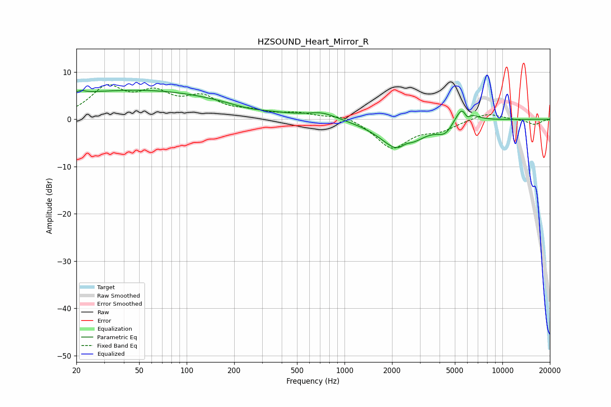

# HZSOUND_Heart_Mirror_R
See [usage instructions](https://github.com/jaakkopasanen/AutoEq#usage) for more options and info.

### Parametric EQs
Apply preamp of -6.2 dB when using parametric equalizer.

|   # | Type    |   Fc (Hz) |    Q |   Gain (dB) |
|-----|---------|-----------|------|-------------|
|   1 | Peaking |        21 | 5.45 |         0.5 |
|   2 | Peaking |        32 | 0.18 |         5.1 |
|   3 | Peaking |       101 | 0.26 |         1.4 |
|   4 | Peaking |       242 | 1.49 |        -0.5 |
|   5 | Peaking |       726 | 1.59 |         1.3 |
|   6 | Peaking |      2265 | 1.21 |        -7   |
|   7 | Peaking |      2444 | 3.6  |         1.4 |
|   8 | Peaking |      4358 | 2.74 |        -2.4 |
|   9 | Peaking |      5694 | 2.82 |         4.8 |
|  10 | Peaking |      5965 | 6    |        -2.5 |

### Fixed Band EQs
When using fixed band (also called graphic) equalizer, apply preamp of **-7.4 dB** (if available) and set gains manually with these parameters.

|   # | Type    |   Fc (Hz) |    Q |   Gain (dB) |
|-----|---------|-----------|------|-------------|
|   1 | Peaking |        31 | 1.41 |         6.3 |
|   2 | Peaking |        62 | 1.41 |         4.6 |
|   3 | Peaking |       125 | 1.41 |         4   |
|   4 | Peaking |       250 | 1.41 |         1.3 |
|   5 | Peaking |       500 | 1.41 |         1.1 |
|   6 | Peaking |      1000 | 1.41 |         1.1 |
|   7 | Peaking |      2000 | 1.41 |        -6.1 |
|   8 | Peaking |      4000 | 1.41 |        -1.9 |
|   9 | Peaking |      8000 | 1.41 |         1.4 |
|  10 | Peaking |     16000 | 1.41 |        -1.1 |

### Graphs

