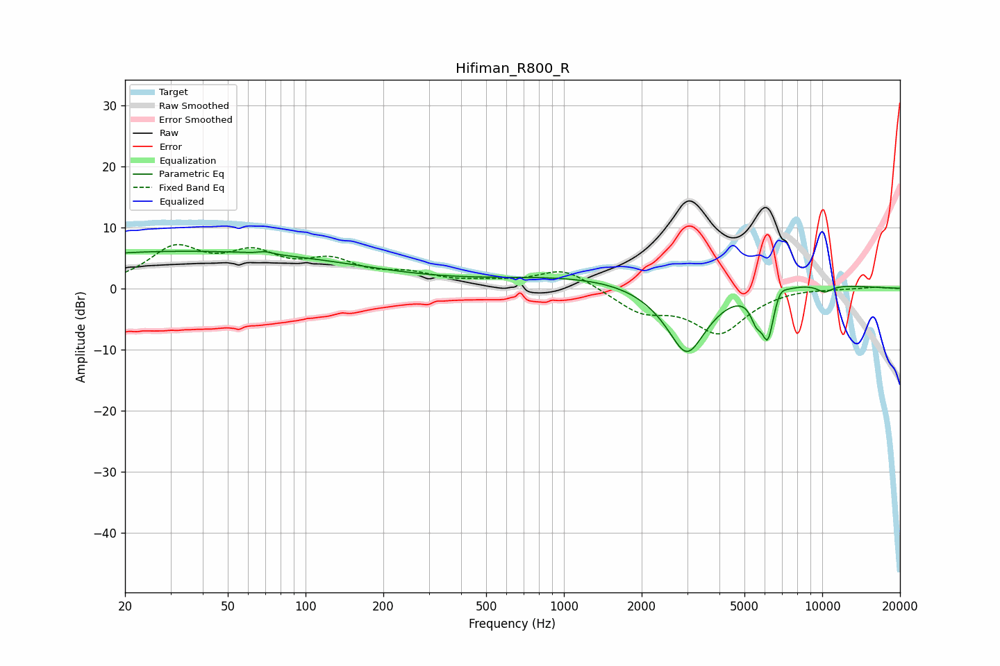

# Hifiman_R800_R
See [usage instructions](https://github.com/jaakkopasanen/AutoEq#usage) for more options and info.

### Parametric EQs
Apply preamp of -6.2 dB when using parametric equalizer.

|   # | Type    |   Fc (Hz) |    Q |   Gain (dB) |
|-----|---------|-----------|------|-------------|
|   1 | Peaking |        34 | 0.18 |         6.1 |
|   2 | Peaking |        70 | 5.45 |         0.4 |
|   3 | Peaking |      2432 | 0.23 |         2.7 |
|   4 | Peaking |      2991 | 1.59 |       -12.9 |
|   5 | Peaking |      5553 | 6    |        -3.4 |
|   6 | Peaking |      6160 | 5.62 |        -7.9 |
|   7 | Peaking |      6857 | 5.93 |         1.5 |
|   8 | Peaking |      9743 | 3.17 |         0.9 |
|   9 | Peaking |      9841 | 5.6  |         0.4 |
|  10 | Peaking |     10000 | 3.48 |        -2.4 |

### Fixed Band EQs
When using fixed band (also called graphic) equalizer, apply preamp of **-7.3 dB** (if available) and set gains manually with these parameters.

|   # | Type    |   Fc (Hz) |    Q |   Gain (dB) |
|-----|---------|-----------|------|-------------|
|   1 | Peaking |        31 | 1.41 |         6.1 |
|   2 | Peaking |        62 | 1.41 |         4.7 |
|   3 | Peaking |       125 | 1.41 |         3.7 |
|   4 | Peaking |       250 | 1.41 |         1.9 |
|   5 | Peaking |       500 | 1.41 |         0.7 |
|   6 | Peaking |      1000 | 1.41 |         3.3 |
|   7 | Peaking |      2000 | 1.41 |        -3.5 |
|   8 | Peaking |      4000 | 1.41 |        -7   |
|   9 | Peaking |      8000 | 1.41 |         0.3 |
|  10 | Peaking |     16000 | 1.41 |         0.3 |

### Graphs

