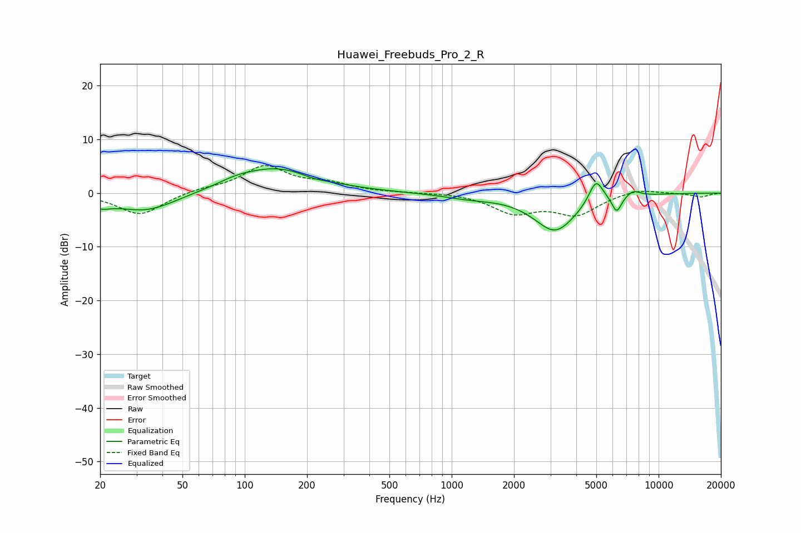

# Huawei_Freebuds_Pro_2_R
See [usage instructions](https://github.com/jaakkopasanen/AutoEq#usage) for more options and info.

### Parametric EQs
Apply preamp of -4.6 dB when using parametric equalizer.

|   # | Type    |   Fc (Hz) |    Q |   Gain (dB) |
|-----|---------|-----------|------|-------------|
|   1 | Peaking |        20 | 2.71 |        -1.4 |
|   2 | Peaking |        33 | 0.95 |        -3.4 |
|   3 | Peaking |        91 | 1.59 |         0.8 |
|   4 | Peaking |       144 | 0.74 |         4.6 |
|   5 | Peaking |       216 | 2.05 |        -0.5 |
|   6 | Peaking |      1219 | 1.14 |        -0.8 |
|   7 | Peaking |      3164 | 1.35 |        -7   |
|   8 | Peaking |      4979 | 3.96 |         4.5 |
|   9 | Peaking |      6273 | 5.99 |        -3.1 |
|  10 | Peaking |      7538 | 4.05 |         1.1 |

### Fixed Band EQs
When using fixed band (also called graphic) equalizer, apply preamp of **-5.2 dB** (if available) and set gains manually with these parameters.

|   # | Type    |   Fc (Hz) |    Q |   Gain (dB) |
|-----|---------|-----------|------|-------------|
|   1 | Peaking |        31 | 1.41 |        -4.1 |
|   2 | Peaking |        62 | 1.41 |         0.7 |
|   3 | Peaking |       125 | 1.41 |         4.9 |
|   4 | Peaking |       250 | 1.41 |         1.6 |
|   5 | Peaking |       500 | 1.41 |         0.1 |
|   6 | Peaking |      1000 | 1.41 |         0.1 |
|   7 | Peaking |      2000 | 1.41 |        -3.5 |
|   8 | Peaking |      4000 | 1.41 |        -3.8 |
|   9 | Peaking |      8000 | 1.41 |         0.9 |
|  10 | Peaking |     16000 | 1.41 |        -0.7 |

### Graphs

