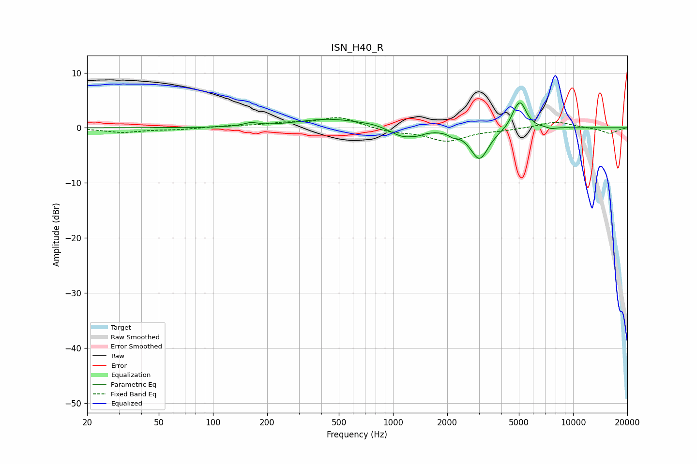

# ISN_H40_R
See [usage instructions](https://github.com/jaakkopasanen/AutoEq#usage) for more options and info.

### Parametric EQs
Apply preamp of -4.6 dB when using parametric equalizer.

|   # | Type    |   Fc (Hz) |    Q |   Gain (dB) |
|-----|---------|-----------|------|-------------|
|   1 | Peaking |       162 | 3.53 |         0.6 |
|   2 | Peaking |       442 | 0.79 |         1.6 |
|   3 | Peaking |       787 | 1.85 |         0.4 |
|   4 | Peaking |      1141 | 1.86 |        -1.9 |
|   5 | Peaking |      1383 | 4.72 |        -0.3 |
|   6 | Peaking |      2153 | 5.98 |        -0.6 |
|   7 | Peaking |      3021 | 2.78 |        -5.7 |
|   8 | Peaking |      4713 | 5.96 |         0.9 |
|   9 | Peaking |      5096 | 4.11 |         4.6 |
|  10 | Peaking |      7582 | 6    |        -0.3 |

### Fixed Band EQs
When using fixed band (also called graphic) equalizer, apply preamp of **-1.9 dB** (if available) and set gains manually with these parameters.

|   # | Type    |   Fc (Hz) |    Q |   Gain (dB) |
|-----|---------|-----------|------|-------------|
|   1 | Peaking |        31 | 1.41 |        -0.8 |
|   2 | Peaking |        62 | 1.41 |        -0.3 |
|   3 | Peaking |       125 | 1.41 |         0.3 |
|   4 | Peaking |       250 | 1.41 |         0.7 |
|   5 | Peaking |       500 | 1.41 |         1.9 |
|   6 | Peaking |      1000 | 1.41 |        -0.7 |
|   7 | Peaking |      2000 | 1.41 |        -2.3 |
|   8 | Peaking |      4000 | 1.41 |        -0.3 |
|   9 | Peaking |      8000 | 1.41 |         1.2 |
|  10 | Peaking |     16000 | 1.41 |        -1.1 |

### Graphs

