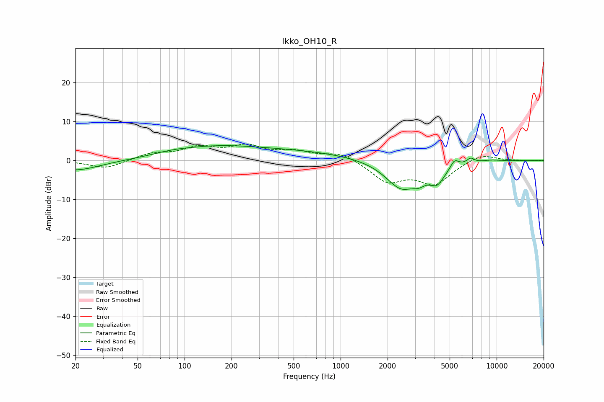

# Ikko_OH10_R
See [usage instructions](https://github.com/jaakkopasanen/AutoEq#usage) for more options and info.

### Parametric EQs
Apply preamp of -3.9 dB when using parametric equalizer.

|   # | Type    |   Fc (Hz) |    Q |   Gain (dB) |
|-----|---------|-----------|------|-------------|
|   1 | Peaking |        20 | 0.92 |        -2.6 |
|   2 | Peaking |        82 | 1.11 |         0.8 |
|   3 | Peaking |       147 | 0.58 |         1.8 |
|   4 | Peaking |       395 | 0.3  |         2.5 |
|   5 | Peaking |      2442 | 1.38 |        -7.1 |
|   6 | Peaking |      3175 | 3.44 |        -1.8 |
|   7 | Peaking |      4147 | 2.7  |        -4.4 |
|   8 | Peaking |      5371 | 5.41 |         2   |
|   9 | Peaking |      6819 | 6    |         1.2 |
|  10 | Peaking |      9257 | 2.34 |         0.3 |

### Fixed Band EQs
When using fixed band (also called graphic) equalizer, apply preamp of **-4.3 dB** (if available) and set gains manually with these parameters.

|   # | Type    |   Fc (Hz) |    Q |   Gain (dB) |
|-----|---------|-----------|------|-------------|
|   1 | Peaking |        31 | 1.41 |        -2.1 |
|   2 | Peaking |        62 | 1.41 |         1.7 |
|   3 | Peaking |       125 | 1.41 |         2.9 |
|   4 | Peaking |       250 | 1.41 |         3.2 |
|   5 | Peaking |       500 | 1.41 |         1.9 |
|   6 | Peaking |      1000 | 1.41 |         2   |
|   7 | Peaking |      2000 | 1.41 |        -5.2 |
|   8 | Peaking |      4000 | 1.41 |        -5.7 |
|   9 | Peaking |      8000 | 1.41 |         1.9 |
|  10 | Peaking |     16000 | 1.41 |        -0.1 |

### Graphs

