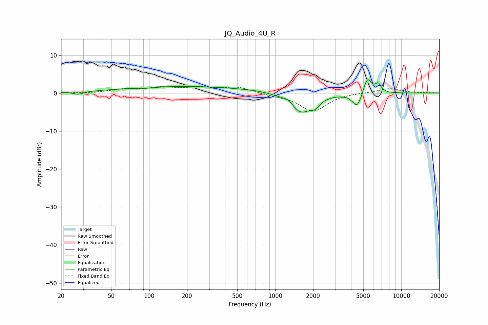

# JQ_Audio_4U_R
See [usage instructions](https://github.com/jaakkopasanen/AutoEq#usage) for more options and info.

### Parametric EQs
Apply preamp of -3.6 dB when using parametric equalizer.

|   # | Type    |   Fc (Hz) |    Q |   Gain (dB) |
|-----|---------|-----------|------|-------------|
|   1 | Peaking |        27 | 3.86 |        -0.7 |
|   2 | Peaking |        96 | 2.11 |        -0.3 |
|   3 | Peaking |       172 | 0.3  |         1.8 |
|   4 | Peaking |       728 | 0.79 |         0.4 |
|   5 | Peaking |      1289 | 3.31 |         1.3 |
|   6 | Peaking |      1575 | 1.59 |        -5.4 |
|   7 | Peaking |      2073 | 4.08 |        -1.6 |
|   8 | Peaking |      4479 | 3.75 |        -4   |
|   9 | Peaking |      5387 | 4.19 |         4.6 |
|  10 | Peaking |      6562 | 6    |         2.1 |

### Fixed Band EQs
When using fixed band (also called graphic) equalizer, apply preamp of **-1.8 dB** (if available) and set gains manually with these parameters.

|   # | Type    |   Fc (Hz) |    Q |   Gain (dB) |
|-----|---------|-----------|------|-------------|
|   1 | Peaking |        31 | 1.41 |        -0.1 |
|   2 | Peaking |        62 | 1.41 |         0.9 |
|   3 | Peaking |       125 | 1.41 |         1.3 |
|   4 | Peaking |       250 | 1.41 |         1.2 |
|   5 | Peaking |       500 | 1.41 |         1.5 |
|   6 | Peaking |      1000 | 1.41 |        -0.5 |
|   7 | Peaking |      2000 | 1.41 |        -4.8 |
|   8 | Peaking |      4000 | 1.41 |         0.1 |
|   9 | Peaking |      8000 | 1.41 |         1.2 |
|  10 | Peaking |     16000 | 1.41 |         0   |

### Graphs

