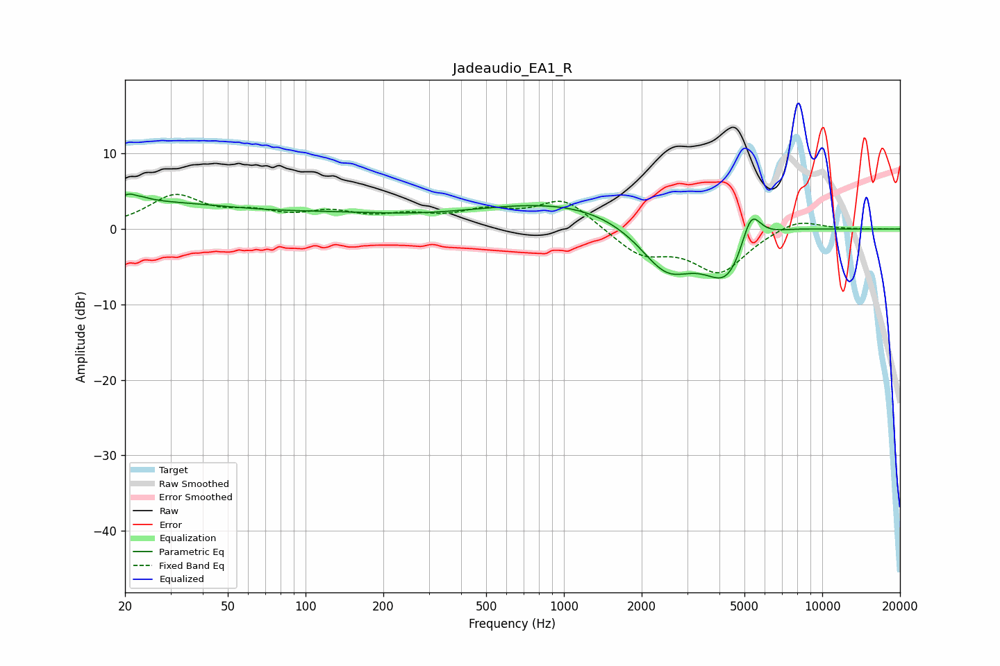

# Jadeaudio_EA1_R
See [usage instructions](https://github.com/jaakkopasanen/AutoEq#usage) for more options and info.

### Parametric EQs
Apply preamp of -4.7 dB when using parametric equalizer.

|   # | Type    |   Fc (Hz) |    Q |   Gain (dB) |
|-----|---------|-----------|------|-------------|
|   1 | Peaking |        20 | 0.3  |         3.5 |
|   2 | Peaking |        22 | 4.72 |         2.9 |
|   3 | Peaking |        22 | 5.84 |        -2   |
|   4 | Peaking |       139 | 0.58 |         1.2 |
|   5 | Peaking |       941 | 0.39 |         3.2 |
|   6 | Peaking |      1254 | 0.64 |         0.5 |
|   7 | Peaking |      2496 | 1.29 |        -6.4 |
|   8 | Peaking |      4317 | 1.54 |        -7.1 |
|   9 | Peaking |      5296 | 3.49 |         5.4 |
|  10 | Peaking |      6418 | 0.95 |         1   |

### Fixed Band EQs
When using fixed band (also called graphic) equalizer, apply preamp of **-4.7 dB** (if available) and set gains manually with these parameters.

|   # | Type    |   Fc (Hz) |    Q |   Gain (dB) |
|-----|---------|-----------|------|-------------|
|   1 | Peaking |        31 | 1.41 |         4.2 |
|   2 | Peaking |        62 | 1.41 |         1.6 |
|   3 | Peaking |       125 | 1.41 |         1.8 |
|   4 | Peaking |       250 | 1.41 |         1.4 |
|   5 | Peaking |       500 | 1.41 |         2   |
|   6 | Peaking |      1000 | 1.41 |         4   |
|   7 | Peaking |      2000 | 1.41 |        -3.3 |
|   8 | Peaking |      4000 | 1.41 |        -5.6 |
|   9 | Peaking |      8000 | 1.41 |         1.6 |
|  10 | Peaking |     16000 | 1.41 |         0   |

### Graphs

