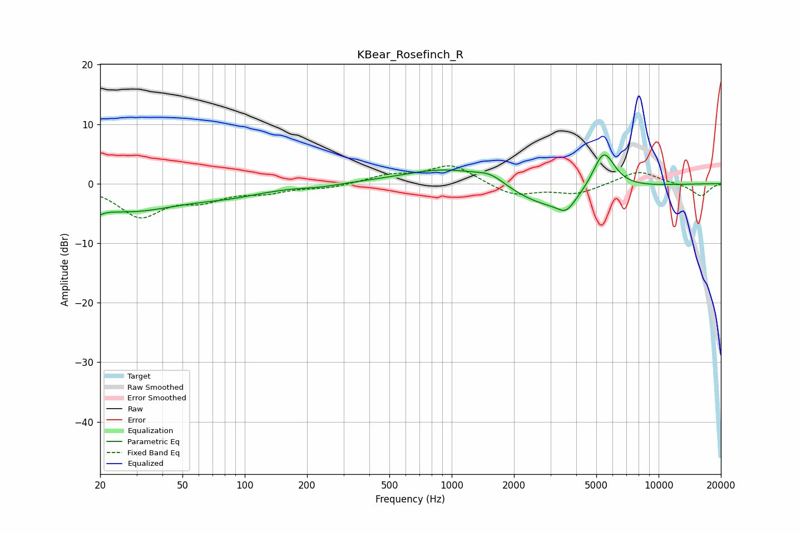

# KBear_Rosefinch_R
See [usage instructions](https://github.com/jaakkopasanen/AutoEq#usage) for more options and info.

### Parametric EQs
Apply preamp of -4.9 dB when using parametric equalizer.

|   # | Type    |   Fc (Hz) |    Q |   Gain (dB) |
|-----|---------|-----------|------|-------------|
|   1 | Peaking |        20 | 5.6  |        -4.3 |
|   2 | Peaking |        20 | 5.82 |         3.3 |
|   3 | Peaking |        27 | 0.52 |        -4.5 |
|   4 | Peaking |        86 | 0.82 |        -1.2 |
|   5 | Peaking |       232 | 1.57 |        -0.4 |
|   6 | Peaking |       981 | 0.66 |         2.9 |
|   7 | Peaking |      1546 | 2.03 |         1.5 |
|   8 | Peaking |      3029 | 0.7  |        -4.5 |
|   9 | Peaking |      3574 | 3.44 |        -2   |
|  10 | Peaking |      5420 | 2.44 |         7.2 |

### Fixed Band EQs
When using fixed band (also called graphic) equalizer, apply preamp of **-3.1 dB** (if available) and set gains manually with these parameters.

|   # | Type    |   Fc (Hz) |    Q |   Gain (dB) |
|-----|---------|-----------|------|-------------|
|   1 | Peaking |        31 | 1.41 |        -5.3 |
|   2 | Peaking |        62 | 1.41 |        -2.3 |
|   3 | Peaking |       125 | 1.41 |        -1.2 |
|   4 | Peaking |       250 | 1.41 |        -0.7 |
|   5 | Peaking |       500 | 1.41 |         1.3 |
|   6 | Peaking |      1000 | 1.41 |         3.2 |
|   7 | Peaking |      2000 | 1.41 |        -2.1 |
|   8 | Peaking |      4000 | 1.41 |        -1.7 |
|   9 | Peaking |      8000 | 1.41 |         2.2 |
|  10 | Peaking |     16000 | 1.41 |        -2.1 |

### Graphs

