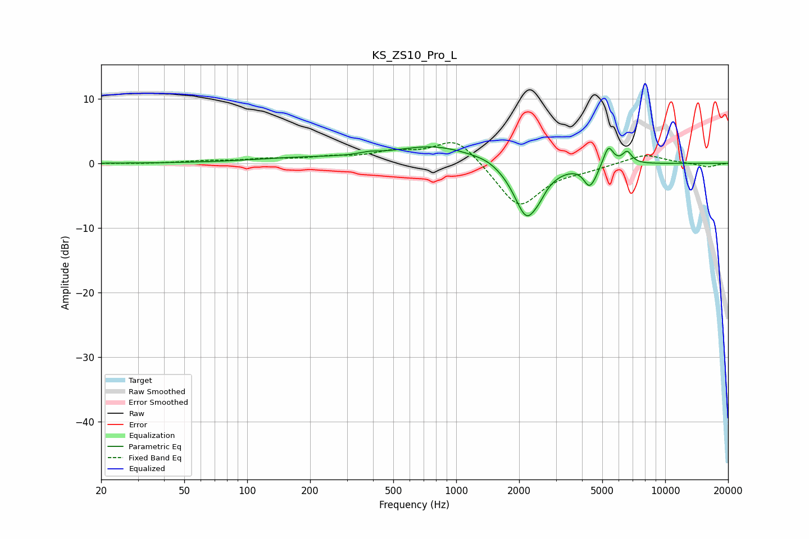

# KS_ZS10_Pro_L
See [usage instructions](https://github.com/jaakkopasanen/AutoEq#usage) for more options and info.

### Parametric EQs
Apply preamp of -2.6 dB when using parametric equalizer.

|   # | Type    |   Fc (Hz) |    Q |   Gain (dB) |
|-----|---------|-----------|------|-------------|
|   1 | Peaking |       180 | 0.59 |         0.7 |
|   2 | Peaking |       382 | 2.98 |         0.4 |
|   3 | Peaking |       797 | 0.71 |         2.7 |
|   4 | Peaking |      1422 | 2.13 |         0.5 |
|   5 | Peaking |      2176 | 2.25 |        -8.7 |
|   6 | Peaking |      2508 | 5.18 |        -0.7 |
|   7 | Peaking |      4323 | 5.28 |        -2.7 |
|   8 | Peaking |      4609 | 6    |        -0.8 |
|   9 | Peaking |      5352 | 6    |         3   |
|  10 | Peaking |      6575 | 6    |         1.8 |

### Fixed Band EQs
When using fixed band (also called graphic) equalizer, apply preamp of **-3.3 dB** (if available) and set gains manually with these parameters.

|   # | Type    |   Fc (Hz) |    Q |   Gain (dB) |
|-----|---------|-----------|------|-------------|
|   1 | Peaking |        31 | 1.41 |        -0.1 |
|   2 | Peaking |        62 | 1.41 |         0.3 |
|   3 | Peaking |       125 | 1.41 |         0.6 |
|   4 | Peaking |       250 | 1.41 |         0.8 |
|   5 | Peaking |       500 | 1.41 |         1.5 |
|   6 | Peaking |      1000 | 1.41 |         4.1 |
|   7 | Peaking |      2000 | 1.41 |        -7   |
|   8 | Peaking |      4000 | 1.41 |        -0.7 |
|   9 | Peaking |      8000 | 1.41 |         1.5 |
|  10 | Peaking |     16000 | 1.41 |        -0.6 |

### Graphs

