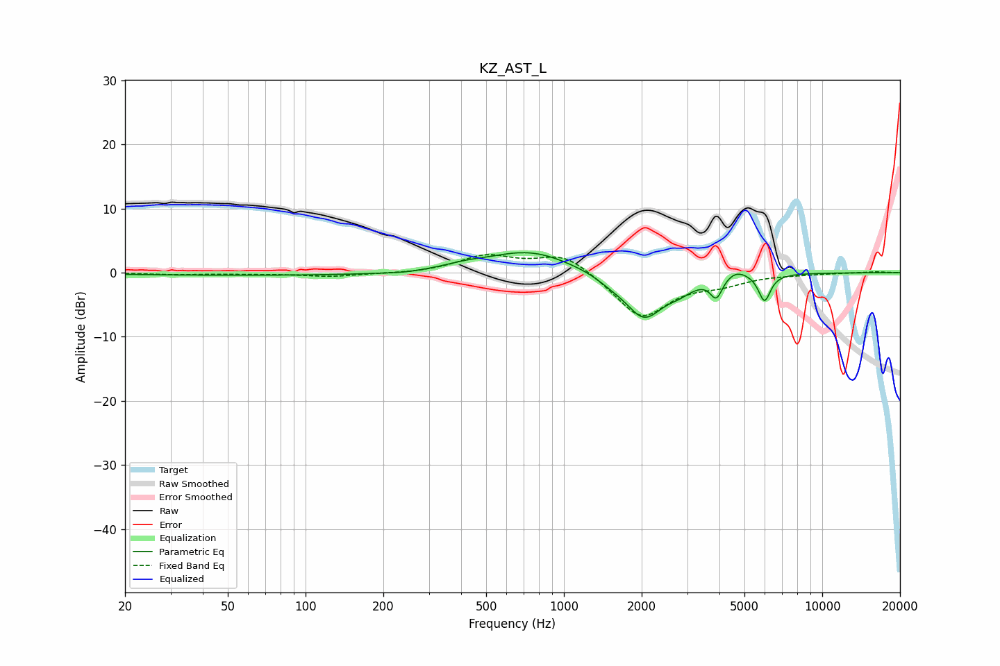

# KZ_AST_L
See [usage instructions](https://github.com/jaakkopasanen/AutoEq#usage) for more options and info.

### Parametric EQs
Apply preamp of -3.2 dB when using parametric equalizer.

|   # | Type    |   Fc (Hz) |    Q |   Gain (dB) |
|-----|---------|-----------|------|-------------|
|   1 | Peaking |        89 | 0.18 |        -0.4 |
|   2 | Peaking |       242 | 2.28 |        -0.2 |
|   3 | Peaking |       412 | 1.65 |         0.6 |
|   4 | Peaking |       735 | 0.86 |         3.5 |
|   5 | Peaking |      1510 | 2.56 |        -0.7 |
|   6 | Peaking |      2043 | 1.83 |        -7   |
|   7 | Peaking |      2818 | 2.56 |        -1.4 |
|   8 | Peaking |      3893 | 6    |        -3.2 |
|   9 | Peaking |      4636 | 3.08 |         1.2 |
|  10 | Peaking |      5978 | 5.99 |        -4.3 |

### Fixed Band EQs
When using fixed band (also called graphic) equalizer, apply preamp of **-2.9 dB** (if available) and set gains manually with these parameters.

|   # | Type    |   Fc (Hz) |    Q |   Gain (dB) |
|-----|---------|-----------|------|-------------|
|   1 | Peaking |        31 | 1.41 |        -0.3 |
|   2 | Peaking |        62 | 1.41 |        -0.1 |
|   3 | Peaking |       125 | 1.41 |        -0.6 |
|   4 | Peaking |       250 | 1.41 |        -0.2 |
|   5 | Peaking |       500 | 1.41 |         2.5 |
|   6 | Peaking |      1000 | 1.41 |         3.1 |
|   7 | Peaking |      2000 | 1.41 |        -7.1 |
|   8 | Peaking |      4000 | 1.41 |        -1.4 |
|   9 | Peaking |      8000 | 1.41 |        -0.1 |
|  10 | Peaking |     16000 | 1.41 |         0.2 |

### Graphs

