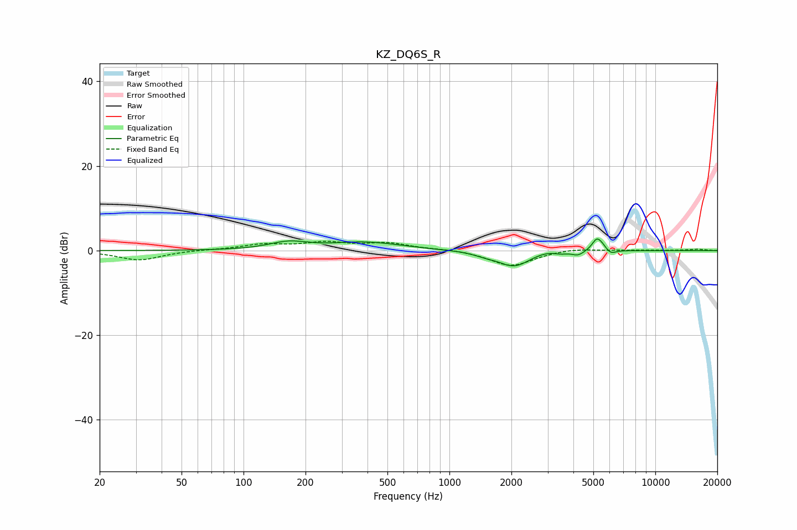

# KZ_DQ6S_R
See [usage instructions](https://github.com/jaakkopasanen/AutoEq#usage) for more options and info.

### Parametric EQs
Apply preamp of -2.8 dB when using parametric equalizer.

|   # | Type    |   Fc (Hz) |    Q |   Gain (dB) |
|-----|---------|-----------|------|-------------|
|   1 | Peaking |       165 | 1.52 |         1.7 |
|   2 | Peaking |       394 | 0.82 |         1.9 |
|   3 | Peaking |      1486 | 2.76 |        -0.6 |
|   4 | Peaking |      2059 | 1.84 |        -3.7 |
|   5 | Peaking |      2922 | 2.47 |         0.6 |
|   6 | Peaking |      3476 | 4.88 |        -0.4 |
|   7 | Peaking |      4212 | 4.85 |        -1   |
|   8 | Peaking |      5196 | 5.97 |         2.8 |
|   9 | Peaking |      5525 | 6    |         0.8 |
|  10 | Peaking |      6068 | 6    |        -1   |

### Fixed Band EQs
When using fixed band (also called graphic) equalizer, apply preamp of **-2.3 dB** (if available) and set gains manually with these parameters.

|   # | Type    |   Fc (Hz) |    Q |   Gain (dB) |
|-----|---------|-----------|------|-------------|
|   1 | Peaking |        31 | 1.41 |        -2.3 |
|   2 | Peaking |        62 | 1.41 |         0.2 |
|   3 | Peaking |       125 | 1.41 |         1.3 |
|   4 | Peaking |       250 | 1.41 |         1.7 |
|   5 | Peaking |       500 | 1.41 |         1.6 |
|   6 | Peaking |      1000 | 1.41 |         0.3 |
|   7 | Peaking |      2000 | 1.41 |        -3.7 |
|   8 | Peaking |      4000 | 1.41 |         0.6 |
|   9 | Peaking |      8000 | 1.41 |         0.1 |
|  10 | Peaking |     16000 | 1.41 |         0.3 |

### Graphs

