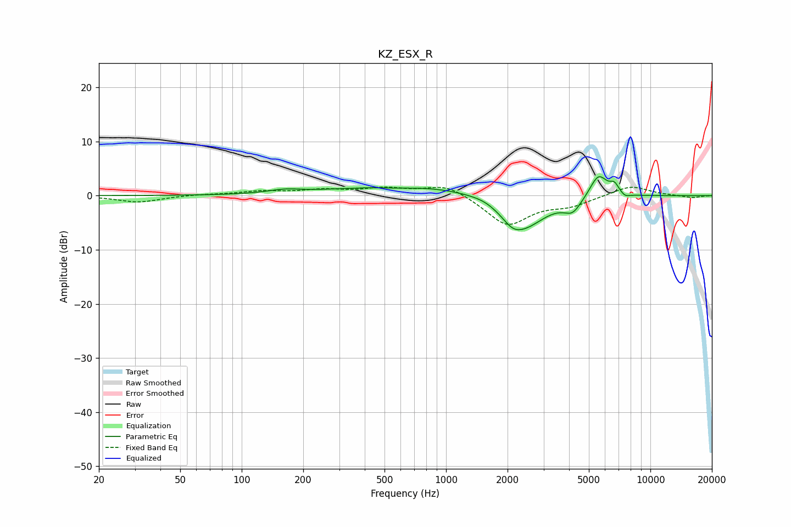

# KZ_ESX_R
See [usage instructions](https://github.com/jaakkopasanen/AutoEq#usage) for more options and info.

### Parametric EQs
Apply preamp of -3.6 dB when using parametric equalizer.

|   # | Type    |   Fc (Hz) |    Q |   Gain (dB) |
|-----|---------|-----------|------|-------------|
|   1 | Peaking |       163 | 1.76 |         0.6 |
|   2 | Peaking |       578 | 1.79 |        -0.2 |
|   3 | Peaking |       780 | 0.33 |         2   |
|   4 | Peaking |      1545 | 2.49 |         0.3 |
|   5 | Peaking |      2114 | 2.97 |        -1.5 |
|   6 | Peaking |      2384 | 1.22 |        -6.3 |
|   7 | Peaking |      4165 | 3.35 |        -2.4 |
|   8 | Peaking |      5572 | 3.21 |         4.3 |
|   9 | Peaking |      6670 | 6    |         1.7 |
|  10 | Peaking |      7515 | 6    |        -0.7 |

### Fixed Band EQs
When using fixed band (also called graphic) equalizer, apply preamp of **-1.7 dB** (if available) and set gains manually with these parameters.

|   # | Type    |   Fc (Hz) |    Q |   Gain (dB) |
|-----|---------|-----------|------|-------------|
|   1 | Peaking |        31 | 1.41 |        -1.2 |
|   2 | Peaking |        62 | 1.41 |         0.2 |
|   3 | Peaking |       125 | 1.41 |         0.7 |
|   4 | Peaking |       250 | 1.41 |         0.9 |
|   5 | Peaking |       500 | 1.41 |         1.2 |
|   6 | Peaking |      1000 | 1.41 |         2.2 |
|   7 | Peaking |      2000 | 1.41 |        -5.5 |
|   8 | Peaking |      4000 | 1.41 |        -1.6 |
|   9 | Peaking |      8000 | 1.41 |         1.9 |
|  10 | Peaking |     16000 | 1.41 |        -0.4 |

### Graphs

