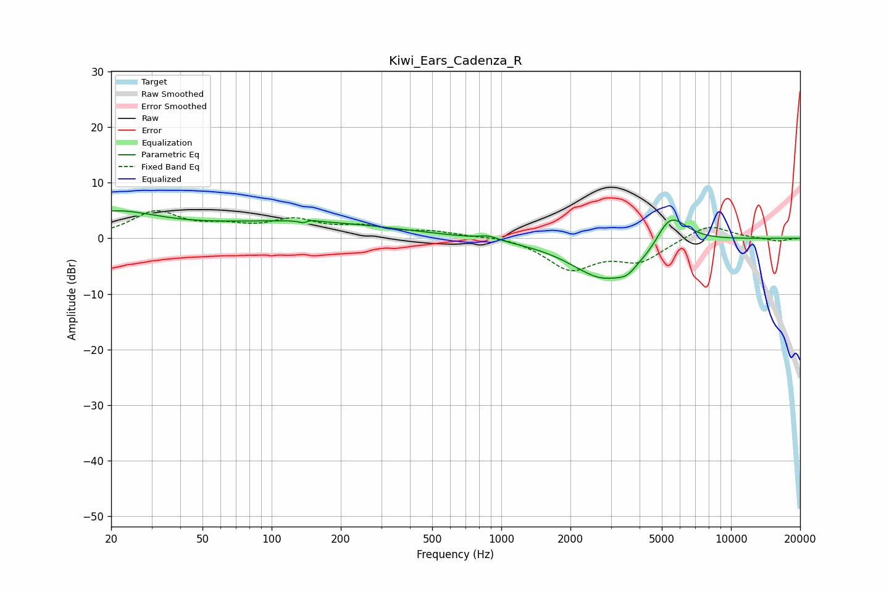

# Kiwi_Ears_Cadenza_R
See [usage instructions](https://github.com/jaakkopasanen/AutoEq#usage) for more options and info.

### Parametric EQs
Apply preamp of -5.1 dB when using parametric equalizer.

|   # | Type    |   Fc (Hz) |    Q |   Gain (dB) |
|-----|---------|-----------|------|-------------|
|   1 | Peaking |        20 | 0.7  |         4.4 |
|   2 | Peaking |       133 | 0.34 |         2.9 |
|   3 | Peaking |       139 | 5.92 |        -2.4 |
|   4 | Peaking |       140 | 5.19 |         2.2 |
|   5 | Peaking |       880 | 3.57 |         0.7 |
|   6 | Peaking |      2780 | 0.98 |        -7.2 |
|   7 | Peaking |      3557 | 3.05 |        -2   |
|   8 | Peaking |      4470 | 5.79 |         0.5 |
|   9 | Peaking |      4481 | 3.48 |        -1.8 |
|  10 | Peaking |      5411 | 1.89 |         6.1 |

### Fixed Band EQs
When using fixed band (also called graphic) equalizer, apply preamp of **-5.1 dB** (if available) and set gains manually with these parameters.

|   # | Type    |   Fc (Hz) |    Q |   Gain (dB) |
|-----|---------|-----------|------|-------------|
|   1 | Peaking |        31 | 1.41 |         4.6 |
|   2 | Peaking |        62 | 1.41 |         1.6 |
|   3 | Peaking |       125 | 1.41 |         2.9 |
|   4 | Peaking |       250 | 1.41 |         1.7 |
|   5 | Peaking |       500 | 1.41 |         1   |
|   6 | Peaking |      1000 | 1.41 |         0.5 |
|   7 | Peaking |      2000 | 1.41 |        -5.4 |
|   8 | Peaking |      4000 | 1.41 |        -3.8 |
|   9 | Peaking |      8000 | 1.41 |         2.7 |
|  10 | Peaking |     16000 | 1.41 |        -0.6 |

### Graphs

