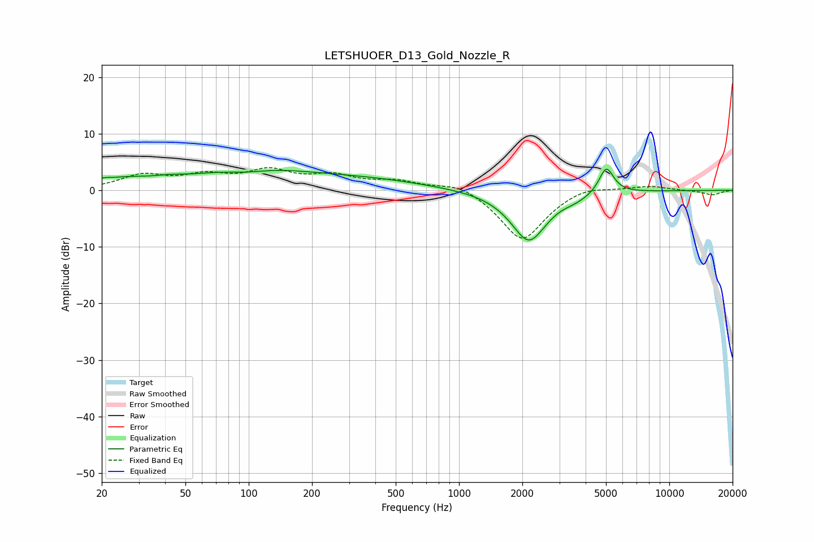

# LETSHUOER_D13_Gold_Nozzle_R
See [usage instructions](https://github.com/jaakkopasanen/AutoEq#usage) for more options and info.

### Parametric EQs
Apply preamp of -3.9 dB when using parametric equalizer.

|   # | Type    |   Fc (Hz) |    Q |   Gain (dB) |
|-----|---------|-----------|------|-------------|
|   1 | Peaking |        20 | 3.93 |         0.6 |
|   2 | Peaking |        26 | 1.21 |         1.4 |
|   3 | Peaking |        42 | 1.93 |         0.5 |
|   4 | Peaking |        98 | 1.37 |        -0.9 |
|   5 | Peaking |       100 | 0.52 |         3.6 |
|   6 | Peaking |       370 | 0.49 |         1.6 |
|   7 | Peaking |      2147 | 1.64 |        -8.9 |
|   8 | Peaking |      3106 | 2.53 |         0.5 |
|   9 | Peaking |      3448 | 1.83 |        -1   |
|  10 | Peaking |      5015 | 3.96 |         4.8 |

### Fixed Band EQs
When using fixed band (also called graphic) equalizer, apply preamp of **-4.1 dB** (if available) and set gains manually with these parameters.

|   # | Type    |   Fc (Hz) |    Q |   Gain (dB) |
|-----|---------|-----------|------|-------------|
|   1 | Peaking |        31 | 1.41 |         2.5 |
|   2 | Peaking |        62 | 1.41 |         2.2 |
|   3 | Peaking |       125 | 1.41 |         3.1 |
|   4 | Peaking |       250 | 1.41 |         2.2 |
|   5 | Peaking |       500 | 1.41 |         1.5 |
|   6 | Peaking |      1000 | 1.41 |         1.6 |
|   7 | Peaking |      2000 | 1.41 |        -9   |
|   8 | Peaking |      4000 | 1.41 |         1.2 |
|   9 | Peaking |      8000 | 1.41 |         0.8 |
|  10 | Peaking |     16000 | 1.41 |        -0.8 |

### Graphs

