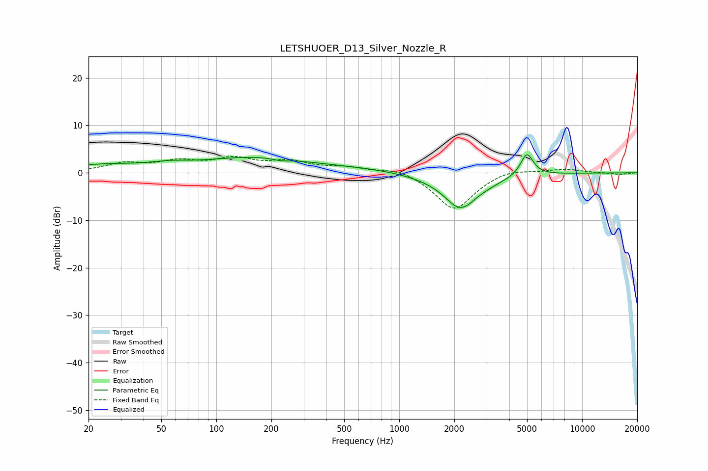

# LETSHUOER_D13_Silver_Nozzle_R
See [usage instructions](https://github.com/jaakkopasanen/AutoEq#usage) for more options and info.

### Parametric EQs
Apply preamp of -3.9 dB when using parametric equalizer.

|   # | Type    |   Fc (Hz) |    Q |   Gain (dB) |
|-----|---------|-----------|------|-------------|
|   1 | Peaking |        24 | 0.68 |         1.5 |
|   2 | Peaking |        55 | 1.31 |         0.8 |
|   3 | Peaking |       168 | 0.46 |         3.2 |
|   4 | Peaking |       227 | 2.91 |        -0.5 |
|   5 | Peaking |       666 | 0.85 |         0.5 |
|   6 | Peaking |      2015 | 4.08 |        -0.4 |
|   7 | Peaking |      2233 | 1.78 |        -0.5 |
|   8 | Peaking |      2238 | 1.33 |        -7.2 |
|   9 | Peaking |      2601 | 2.75 |         0.7 |
|  10 | Peaking |      4989 | 4    |         4.8 |

### Fixed Band EQs
When using fixed band (also called graphic) equalizer, apply preamp of **-3.6 dB** (if available) and set gains manually with these parameters.

|   # | Type    |   Fc (Hz) |    Q |   Gain (dB) |
|-----|---------|-----------|------|-------------|
|   1 | Peaking |        31 | 1.41 |         1.8 |
|   2 | Peaking |        62 | 1.41 |         2.1 |
|   3 | Peaking |       125 | 1.41 |         2.6 |
|   4 | Peaking |       250 | 1.41 |         2.1 |
|   5 | Peaking |       500 | 1.41 |         1   |
|   6 | Peaking |      1000 | 1.41 |         1.2 |
|   7 | Peaking |      2000 | 1.41 |        -7.9 |
|   8 | Peaking |      4000 | 1.41 |         1.1 |
|   9 | Peaking |      8000 | 1.41 |         0.8 |
|  10 | Peaking |     16000 | 1.41 |        -0.4 |

### Graphs

