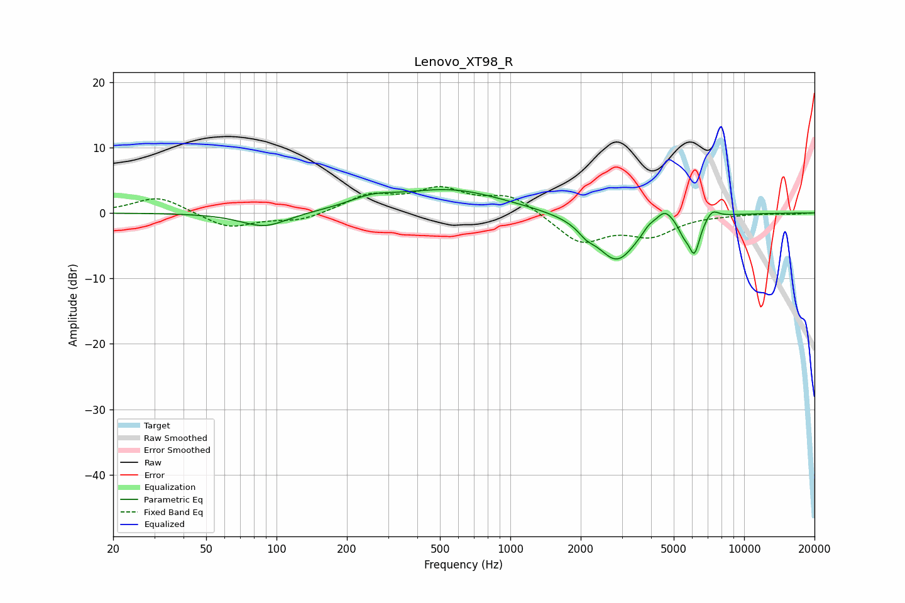

# Lenovo_XT98_R
See [usage instructions](https://github.com/jaakkopasanen/AutoEq#usage) for more options and info.

### Parametric EQs
Apply preamp of -3.7 dB when using parametric equalizer.

|   # | Type    |   Fc (Hz) |    Q |   Gain (dB) |
|-----|---------|-----------|------|-------------|
|   1 | Peaking |        89 | 1.42 |        -2.3 |
|   2 | Peaking |       256 | 1.45 |         1.4 |
|   3 | Peaking |       552 | 0.61 |         3.5 |
|   4 | Peaking |      2113 | 4.1  |        -1.1 |
|   5 | Peaking |      2853 | 1.58 |        -7.4 |
|   6 | Peaking |      3904 | 6    |         0.8 |
|   7 | Peaking |      4562 | 3.66 |         2.4 |
|   8 | Peaking |      5519 | 5.73 |        -1.7 |
|   9 | Peaking |      6126 | 5.56 |        -5.4 |
|  10 | Peaking |      7299 | 4.91 |         1.4 |

### Fixed Band EQs
When using fixed band (also called graphic) equalizer, apply preamp of **-4.1 dB** (if available) and set gains manually with these parameters.

|   # | Type    |   Fc (Hz) |    Q |   Gain (dB) |
|-----|---------|-----------|------|-------------|
|   1 | Peaking |        31 | 1.41 |         2.6 |
|   2 | Peaking |        62 | 1.41 |        -2.3 |
|   3 | Peaking |       125 | 1.41 |        -1.2 |
|   4 | Peaking |       250 | 1.41 |         2.6 |
|   5 | Peaking |       500 | 1.41 |         3.3 |
|   6 | Peaking |      1000 | 1.41 |         2.7 |
|   7 | Peaking |      2000 | 1.41 |        -4.5 |
|   8 | Peaking |      4000 | 1.41 |        -3.1 |
|   9 | Peaking |      8000 | 1.41 |        -0.2 |
|  10 | Peaking |     16000 | 1.41 |        -0.2 |

### Graphs

