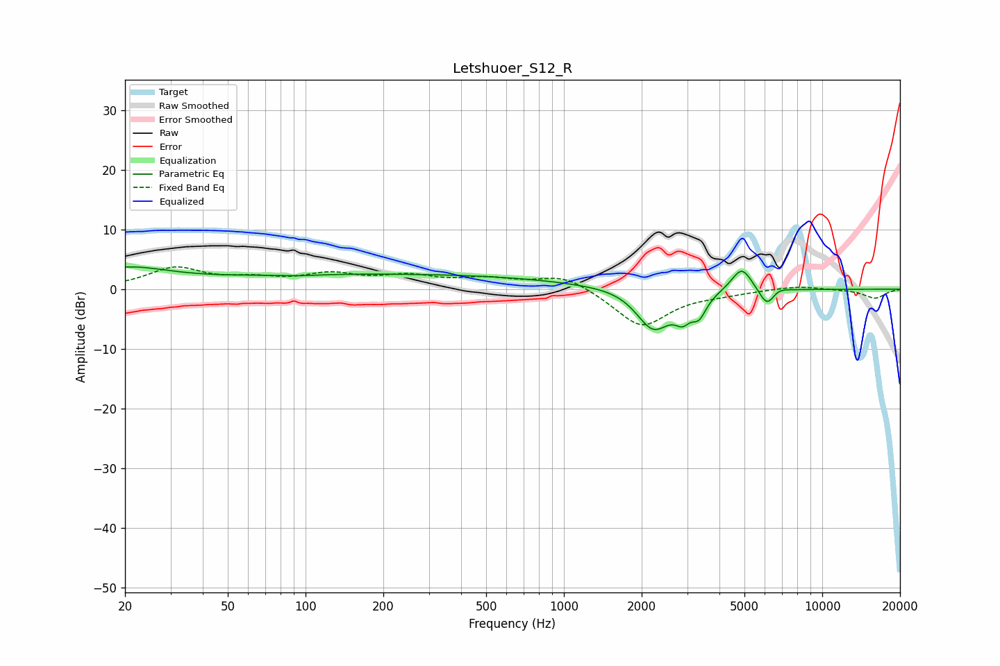

# Letshuoer_S12_R
See [usage instructions](https://github.com/jaakkopasanen/AutoEq#usage) for more options and info.

### Parametric EQs
Apply preamp of -3.8 dB when using parametric equalizer.

|   # | Type    |   Fc (Hz) |    Q |   Gain (dB) |
|-----|---------|-----------|------|-------------|
|   1 | Peaking |        20 | 0.84 |         3.1 |
|   2 | Peaking |        93 | 2    |        -0.2 |
|   3 | Peaking |       204 | 0.18 |         2.5 |
|   4 | Peaking |      1920 | 1.31 |         1.4 |
|   5 | Peaking |      2209 | 1.88 |        -8   |
|   6 | Peaking |      2881 | 4.85 |        -2.6 |
|   7 | Peaking |      3335 | 5.01 |        -3.1 |
|   8 | Peaking |      4879 | 3.46 |         4.1 |
|   9 | Peaking |      6126 | 4.4  |        -3.3 |
|  10 | Peaking |      6672 | 4.06 |         0.8 |

### Fixed Band EQs
When using fixed band (also called graphic) equalizer, apply preamp of **-3.8 dB** (if available) and set gains manually with these parameters.

|   # | Type    |   Fc (Hz) |    Q |   Gain (dB) |
|-----|---------|-----------|------|-------------|
|   1 | Peaking |        31 | 1.41 |         3.4 |
|   2 | Peaking |        62 | 1.41 |         1.3 |
|   3 | Peaking |       125 | 1.41 |         2.2 |
|   4 | Peaking |       250 | 1.41 |         1.9 |
|   5 | Peaking |       500 | 1.41 |         1.5 |
|   6 | Peaking |      1000 | 1.41 |         2.5 |
|   7 | Peaking |      2000 | 1.41 |        -6.4 |
|   8 | Peaking |      4000 | 1.41 |        -0.6 |
|   9 | Peaking |      8000 | 1.41 |         0.6 |
|  10 | Peaking |     16000 | 1.41 |        -1.5 |

### Graphs

