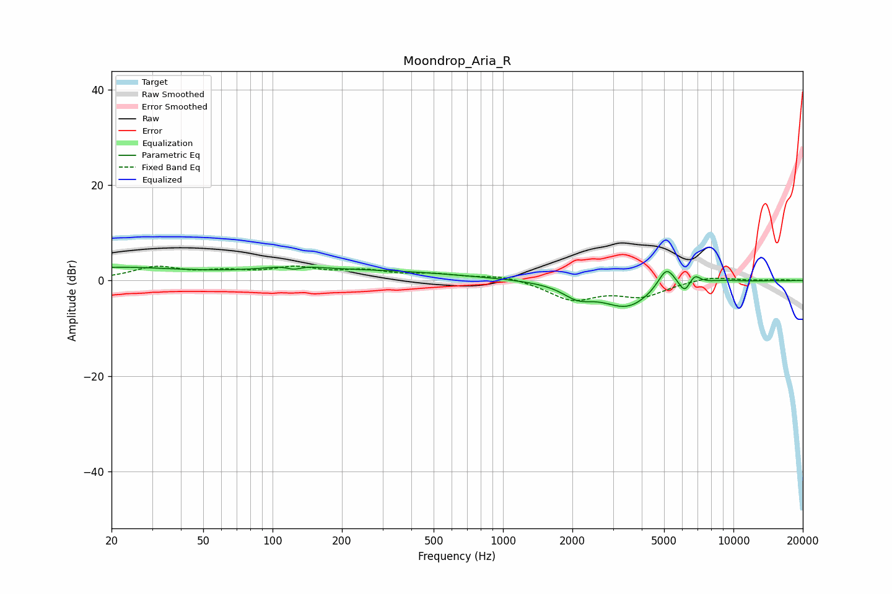

# Moondrop_Aria_R
See [usage instructions](https://github.com/jaakkopasanen/AutoEq#usage) for more options and info.

### Parametric EQs
Apply preamp of -2.9 dB when using parametric equalizer.

|   # | Type    |   Fc (Hz) |    Q |   Gain (dB) |
|-----|---------|-----------|------|-------------|
|   1 | Peaking |        20 | 0.5  |         2.5 |
|   2 | Peaking |       123 | 2.1  |         2   |
|   3 | Peaking |       124 | 3.45 |        -1.9 |
|   4 | Peaking |       198 | 0.29 |         2.2 |
|   5 | Peaking |      2110 | 2.17 |        -2.6 |
|   6 | Peaking |      3457 | 1.28 |        -5.5 |
|   7 | Peaking |      5118 | 3.68 |         4.6 |
|   8 | Peaking |      6134 | 5.91 |        -2.4 |
|   9 | Peaking |      6801 | 5.96 |         1.8 |
|  10 | Peaking |      8896 | 1.91 |         0.3 |

### Fixed Band EQs
When using fixed band (also called graphic) equalizer, apply preamp of **-3.1 dB** (if available) and set gains manually with these parameters.

|   # | Type    |   Fc (Hz) |    Q |   Gain (dB) |
|-----|---------|-----------|------|-------------|
|   1 | Peaking |        31 | 1.41 |         2.6 |
|   2 | Peaking |        62 | 1.41 |         1.5 |
|   3 | Peaking |       125 | 1.41 |         2.3 |
|   4 | Peaking |       250 | 1.41 |         1.7 |
|   5 | Peaking |       500 | 1.41 |         1.1 |
|   6 | Peaking |      1000 | 1.41 |         1.1 |
|   7 | Peaking |      2000 | 1.41 |        -3.9 |
|   8 | Peaking |      4000 | 1.41 |        -3.1 |
|   9 | Peaking |      8000 | 1.41 |         1   |
|  10 | Peaking |     16000 | 1.41 |         0.2 |

### Graphs

