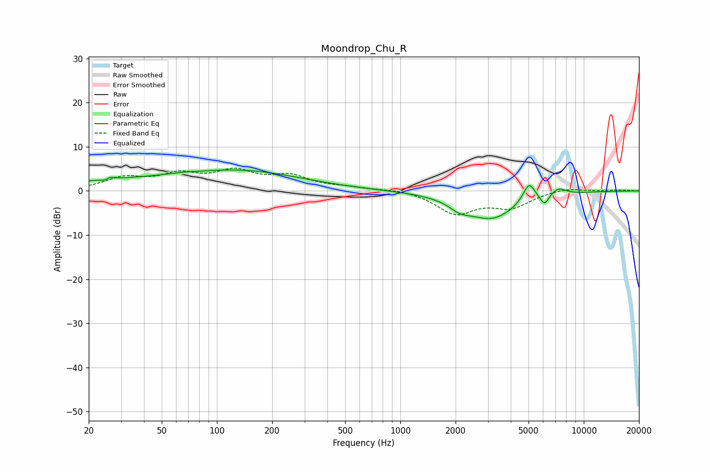

# Moondrop_Chu_R
See [usage instructions](https://github.com/jaakkopasanen/AutoEq#usage) for more options and info.

### Parametric EQs
Apply preamp of -4.8 dB when using parametric equalizer.

|   # | Type    |   Fc (Hz) |    Q |   Gain (dB) |
|-----|---------|-----------|------|-------------|
|   1 | Peaking |        25 | 5.87 |        -2.2 |
|   2 | Peaking |        25 | 5.58 |         2.3 |
|   3 | Peaking |        28 | 0.35 |         1.9 |
|   4 | Peaking |        64 | 2.2  |         0.2 |
|   5 | Peaking |       140 | 0.43 |         4.2 |
|   6 | Peaking |      2108 | 2.59 |        -1.6 |
|   7 | Peaking |      3128 | 0.98 |        -6.2 |
|   8 | Peaking |      5024 | 4.2  |         4.4 |
|   9 | Peaking |      6104 | 6    |        -2.4 |
|  10 | Peaking |      7275 | 3.38 |         1.6 |

### Fixed Band EQs
When using fixed band (also called graphic) equalizer, apply preamp of **-5.3 dB** (if available) and set gains manually with these parameters.

|   # | Type    |   Fc (Hz) |    Q |   Gain (dB) |
|-----|---------|-----------|------|-------------|
|   1 | Peaking |        31 | 1.41 |         2.7 |
|   2 | Peaking |        62 | 1.41 |         3.2 |
|   3 | Peaking |       125 | 1.41 |         3.9 |
|   4 | Peaking |       250 | 1.41 |         3   |
|   5 | Peaking |       500 | 1.41 |         0.6 |
|   6 | Peaking |      1000 | 1.41 |         0.5 |
|   7 | Peaking |      2000 | 1.41 |        -5   |
|   8 | Peaking |      4000 | 1.41 |        -3.4 |
|   9 | Peaking |      8000 | 1.41 |         0.8 |
|  10 | Peaking |     16000 | 1.41 |         0.2 |

### Graphs

