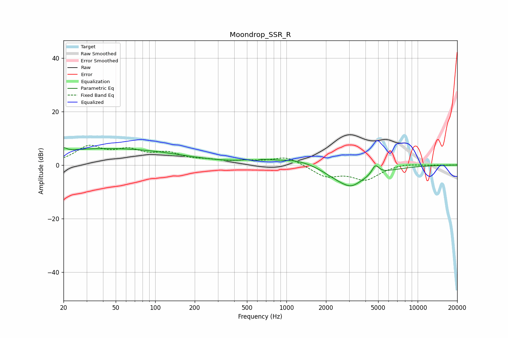

# Moondrop_SSR_R
See [usage instructions](https://github.com/jaakkopasanen/AutoEq#usage) for more options and info.

### Parametric EQs
Apply preamp of -6.5 dB when using parametric equalizer.

|   # | Type    |   Fc (Hz) |    Q |   Gain (dB) |
|-----|---------|-----------|------|-------------|
|   1 | Peaking |        20 | 5.96 |         1.6 |
|   2 | Peaking |        24 | 0.79 |         1.1 |
|   3 | Peaking |        55 | 0.29 |         5.7 |
|   4 | Peaking |       568 | 5.88 |         2.2 |
|   5 | Peaking |       570 | 5.78 |        -3.6 |
|   6 | Peaking |       574 | 2.5  |         1.5 |
|   7 | Peaking |      1312 | 0.68 |         3.5 |
|   8 | Peaking |      2869 | 0.81 |        -8   |
|   9 | Peaking |      3122 | 2.72 |        -1.4 |
|  10 | Peaking |      4765 | 5.03 |         3.7 |

### Fixed Band EQs
When using fixed band (also called graphic) equalizer, apply preamp of **-7.5 dB** (if available) and set gains manually with these parameters.

|   # | Type    |   Fc (Hz) |    Q |   Gain (dB) |
|-----|---------|-----------|------|-------------|
|   1 | Peaking |        31 | 1.41 |         6.4 |
|   2 | Peaking |        62 | 1.41 |         4.5 |
|   3 | Peaking |       125 | 1.41 |         3.7 |
|   4 | Peaking |       250 | 1.41 |         1.3 |
|   5 | Peaking |       500 | 1.41 |         1.1 |
|   6 | Peaking |      1000 | 1.41 |         3.1 |
|   7 | Peaking |      2000 | 1.41 |        -4.1 |
|   8 | Peaking |      4000 | 1.41 |        -5.2 |
|   9 | Peaking |      8000 | 1.41 |         0.7 |
|  10 | Peaking |     16000 | 1.41 |         0   |

### Graphs

