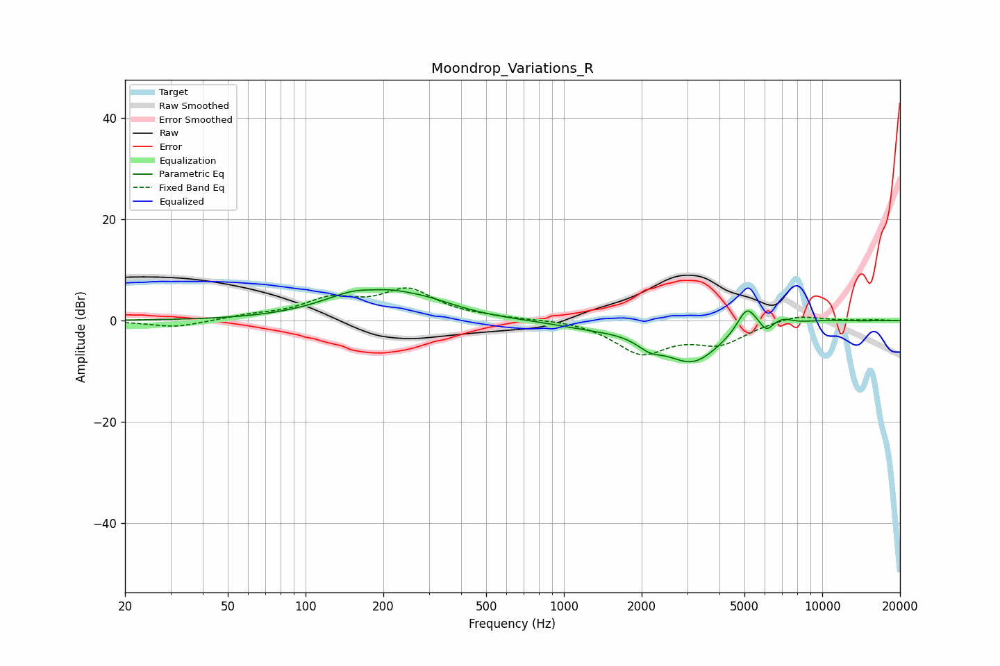

# Moondrop_Variations_R
See [usage instructions](https://github.com/jaakkopasanen/AutoEq#usage) for more options and info.

### Parametric EQs
Apply preamp of -6.2 dB when using parametric equalizer.

|   # | Type    |   Fc (Hz) |    Q |   Gain (dB) |
|-----|---------|-----------|------|-------------|
|   1 | Peaking |       174 | 0.93 |         6.2 |
|   2 | Peaking |       180 | 2.27 |        -1   |
|   3 | Peaking |       295 | 1.07 |         2   |
|   4 | Peaking |      1269 | 0.97 |        -1   |
|   5 | Peaking |      2147 | 2.82 |        -2.1 |
|   6 | Peaking |      3153 | 1.22 |        -7.9 |
|   7 | Peaking |      5107 | 3.69 |         5.1 |
|   8 | Peaking |      6078 | 6    |        -1.8 |
|   9 | Peaking |      7025 | 3.64 |         1.1 |
|  10 | Peaking |     10000 | 1.52 |         0.3 |

### Fixed Band EQs
When using fixed band (also called graphic) equalizer, apply preamp of **-6.5 dB** (if available) and set gains manually with these parameters.

|   # | Type    |   Fc (Hz) |    Q |   Gain (dB) |
|-----|---------|-----------|------|-------------|
|   1 | Peaking |        31 | 1.41 |        -1.4 |
|   2 | Peaking |        62 | 1.41 |         0.8 |
|   3 | Peaking |       125 | 1.41 |         3.7 |
|   4 | Peaking |       250 | 1.41 |         5.7 |
|   5 | Peaking |       500 | 1.41 |         0.4 |
|   6 | Peaking |      1000 | 1.41 |         0.4 |
|   7 | Peaking |      2000 | 1.41 |        -6.2 |
|   8 | Peaking |      4000 | 1.41 |        -4.1 |
|   9 | Peaking |      8000 | 1.41 |         1.3 |
|  10 | Peaking |     16000 | 1.41 |         0.1 |

### Graphs

