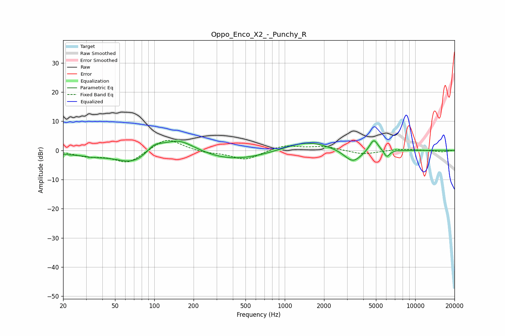

# Oppo_Enco_X2_-_Punchy_R
See [usage instructions](https://github.com/jaakkopasanen/AutoEq#usage) for more options and info.

### Parametric EQs
Apply preamp of -3.4 dB when using parametric equalizer.

|   # | Type    |   Fc (Hz) |    Q |   Gain (dB) |
|-----|---------|-----------|------|-------------|
|   1 | Peaking |        34 | 0.28 |        -1.3 |
|   2 | Peaking |        34 | 2.4  |        -0.5 |
|   3 | Peaking |        70 | 1.12 |        -3.9 |
|   4 | Peaking |       100 | 2.43 |         2.7 |
|   5 | Peaking |       152 | 1.04 |         5.4 |
|   6 | Peaking |       395 | 0.53 |        -3.6 |
|   7 | Peaking |      1471 | 0.8  |         3.5 |
|   8 | Peaking |      3324 | 2.08 |        -4.6 |
|   9 | Peaking |      4810 | 4.18 |         4.3 |
|  10 | Peaking |      6056 | 6    |        -2.5 |

### Fixed Band EQs
When using fixed band (also called graphic) equalizer, apply preamp of **-3.5 dB** (if available) and set gains manually with these parameters.

|   # | Type    |   Fc (Hz) |    Q |   Gain (dB) |
|-----|---------|-----------|------|-------------|
|   1 | Peaking |        31 | 1.41 |        -1.7 |
|   2 | Peaking |        62 | 1.41 |        -4.4 |
|   3 | Peaking |       125 | 1.41 |         4.5 |
|   4 | Peaking |       250 | 1.41 |        -0.8 |
|   5 | Peaking |       500 | 1.41 |        -3.3 |
|   6 | Peaking |      1000 | 1.41 |         1.8 |
|   7 | Peaking |      2000 | 1.41 |         1.3 |
|   8 | Peaking |      4000 | 1.41 |        -1.4 |
|   9 | Peaking |      8000 | 1.41 |         0.5 |
|  10 | Peaking |     16000 | 1.41 |        -0.5 |

### Graphs

